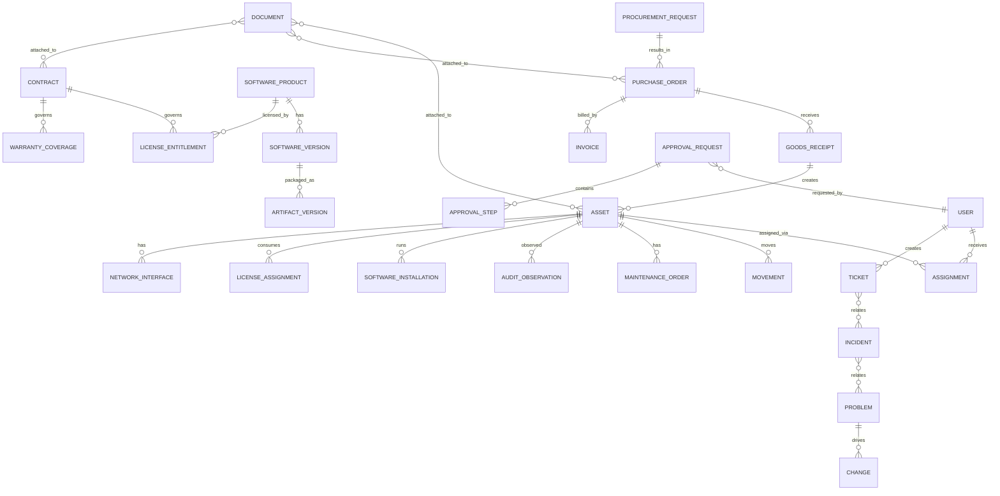

# DATA MODEL + ENTITY RELATIONSHIP SPEC
## IT Operations Hub — Canonical Data Model

**Version:** 0.1  
**Status:** Foundation Draft  
**Parent:** `SYSTEM_WORKFLOW_INDEX_TRACEABILITY_MATRIX.md`  
**Purpose:** Define canonical entities, aggregate boundaries, relationships, keys, history strategy, state storage, uniqueness rules, referential integrity, and cross-domain data ownership.

---

# 1. Mục tiêu

Tài liệu này chuyển hệ thống từ **workflow design** sang **data architecture**.

Mục tiêu chính:

```text
Workflow
→ Entity
→ Aggregate Root
→ Relationship
→ State
→ History
→ Constraint
→ Storage Boundary
```

Tài liệu phải trả lời:

1. Entity nào là nguồn dữ liệu chuẩn?
2. Entity nào là Aggregate Root?
3. Quan hệ nào là 1-1, 1-n, n-n?
4. Field nào mutable, field nào immutable?
5. Current state lưu ở đâu?
6. History / timeline / audit lưu ở đâu?
7. Khi nào dùng snapshot?
8. Khi nào dùng event history?
9. Unique constraint nào bắt buộc?
10. Foreign key nào nên strict?
11. Cross-domain reference xử lý thế nào?
12. Soft delete / archive / retention ra sao?
13. Làm sao tránh duplicate Asset/User/Ticket/Invoice?
14. Làm sao giữ lịch sử nhưng vẫn query nhanh?

---

# 2. Nguyên tắc thiết kế

## 2.1 Canonical Source of Truth

Mỗi loại dữ liệu có đúng một owner chính.

Ví dụ:

```text
Asset identity           → Asset domain
User employment context  → Identity domain
Ticket state             → Helpdesk domain
License entitlement      → License domain
Purchase order           → Procurement domain
Approval decision        → Approval engine
SLA state                → SLA engine
```

Các domain khác chỉ:

```text
reference
cache
snapshot
project
```

không sở hữu bản gốc.

---

## 2.2 Current State + History

Không dùng một bảng để vừa lưu current state vừa chứa toàn bộ lịch sử.

Pattern ưu tiên:

```text
CURRENT TABLE
+
HISTORY / EVENT TABLE
+
AUDIT TRAIL
```

Ví dụ:

```text
assets
asset_state_history
audit_events
```

---

## 2.3 Immutable Internal ID

Mọi entity chính có:

```text
id = immutable internal identifier
```

Display code chỉ để người dùng đọc:

```text
AST-2026-00042
TCK-2026-01234
INC-2026-00102
```

Display code không dùng làm primary key.

---

## 2.4 External IDs

Entity có thể map nhiều hệ thống ngoài:

```text
external_identity
external_reference
```

Ví dụ:

```text
Entra object ID
HR employee ID
Zabbix host ID
Slack user ID
Vendor invoice number
```

Không nhét tất cả vào một field `external_id`.

---

## 2.5 No Generic Status

Không dùng:

```text
status = "active"
```

cho mọi thứ.

State phải domain-specific.

Ví dụ Asset:

```text
lifecycle_state
operational_state
health_state
assignment_state
warranty_state
compliance_state
risk_state
```

---

# 3. Recommended Logical Storage

Không bắt buộc mỗi domain dùng DB riêng.

Logical recommendation:

```text
Relational Core
→ canonical entities / relationships / transactions

Event Store / Append-only Log
→ domain events / audit

Search Index
→ full-text / global search / operational lookup

Time-series Store
→ high-volume monitoring/telemetry

Object Storage
→ files/documents/artifacts/evidence
```

---

# 4. High-level Domain Map

```text
Identity
  ↓
Helpdesk / Incident
  ↓
Asset / Assignment / Location
  ↓
Maintenance / Audit / Network
  ↓
Software / License
  ↓
Procurement / Contract
  ↓
Control Plane
  ↓
Notification / Reporting / Audit
```

---

# 5. Aggregate Roots

| Domain | Aggregate Root | Important Children |
|---|---|---|
| Identity | User | ExternalIdentity, GroupMembership, RoleBinding |
| Asset | Asset | Interface, StateHistory, AssetAttribute |
| Assignment | Assignment | AssignmentItem, Confirmation |
| Warehouse | GoodsReceipt | GoodsReceiptLine |
| Ticket | Ticket | Message, TicketRelation |
| Incident | Incident | IncidentEvent, IncidentRelation |
| Problem | Problem | RCA, KnownError, Workaround |
| Change | Change | ChangeTask, ApprovalRef, Verification |
| Maintenance | MaintenanceOrder | Diagnosis, PartUsage, RepairAction |
| Audit | Audit | AuditObservation, AuditException |
| Network | NetworkDevice / NetworkObservation | InterfaceObservation, TopologyEdge |
| Software | SoftwareProduct | SoftwareVersion, CatalogPolicy |
| Artifact | ArtifactVersion | ScanResult, SignatureResult |
| License | LicenseEntitlement | LicenseAssignment |
| Procurement | ProcurementRequest / PurchaseOrder | Lines, Amendments |
| Contract | Contract | Coverage, Renewal |
| Invoice | Invoice | InvoiceLine, MatchResult |
| Approval | ApprovalRequest | ApprovalStep, Decision |
| SLA | SLAInstance | SLAEvent |
| Automation | AutomationRule | RuleVersion, Execution |
| Document | Document | DocumentVersion, Signature |
| Notification | Notification | DeliveryAttempt |
| Reporting | MetricDefinition | MetricSnapshot |

---

# 6. Core ERD Overview



---

# 7. Identity Domain

## 7.1 `users`

Canonical internal user record.

```yaml
users:
  id: uuid
  display_code:
  username:
  primary_email:
  display_name:
  employment_status:
  department_id:
  manager_user_id:
  location_id:
  cost_center_id:
  job_title:
  start_date:
  end_date:
  created_at:
  updated_at:
  archived_at:
```

### Constraints

```text
id UNIQUE PK
display_code UNIQUE
primary_email indexed
manager_user_id FK users.id nullable
```

Không bắt buộc `primary_email` globally unique nếu multi-tenant cho phép overlap.

---

## 7.2 `external_identities`

```yaml
external_identities:
  id:
  user_id:
  provider_id:
  provider_type:
  external_subject:
  external_tenant:
  username:
  email:
  last_synced_at:
  is_authoritative:
```

Unique:

```text
(provider_id, external_subject)
```

---

## 7.3 `departments`

```yaml
departments:
  id:
  name:
  parent_department_id:
  manager_user_id:
  cost_center_id:
  status:
```

Self-referencing hierarchy.

---

## 7.4 `groups`

```yaml
groups:
  id:
  name:
  type:
  source:
  external_group_id:
```

---

## 7.5 `group_memberships`

```yaml
group_memberships:
  group_id:
  user_id:
  source:
  valid_from:
  valid_until:
```

Unique active membership:

```text
(group_id, user_id, source)
```

---

## 7.6 `roles`

```yaml
roles:
  id:
  code:
  name:
  type:
  description:
  status:
```

---

## 7.7 `permissions`

```yaml
permissions:
  id:
  code:
  resource_type:
  action:
```

Example:

```text
asset.read
asset.assign
network.change_vlan
```

---

## 7.8 `role_permissions`

n-n:

```text
roles ↔ permissions
```

---

## 7.9 `role_bindings`

```yaml
role_bindings:
  id:
  principal_type:
  principal_id:
  role_id:
  scope_type:
  scope_id:
  source:
  valid_from:
  valid_until:
  reason:
  created_by:
```

No physical FK to polymorphic `principal_id` if multiple principal tables; enforce in application/domain layer.

---

# 8. Asset Domain

## 8.1 `assets`

Aggregate root.

```yaml
assets:
  id:
  asset_code:
  asset_model_id:
  serial_number:
  asset_tag:
  lifecycle_state:
  operational_state:
  health_state:
  assignment_state:
  warranty_state:
  compliance_state:
  risk_state:
  current_location_id:
  current_owner_user_id:
  acquisition_date:
  purchase_cost:
  currency:
  created_at:
  updated_at:
  retired_at:
  disposed_at:
```

### Unique constraints

```text
asset_code UNIQUE
asset_tag UNIQUE when not null
```

Serial uniqueness:

```text
(manufacturer_id, serial_number)
```

or:

```text
(asset_model_id, serial_number)
```

depending manufacturer behavior.

---

## 8.2 `asset_models`

```yaml
asset_models:
  id:
  manufacturer_id:
  model_name:
  category_id:
  specifications_json:
  support_end_date:
```

---

## 8.3 `asset_categories`

Hierarchy:

```text
Computer
├─ Laptop
├─ Desktop
Server
Network
Monitor
Mobile
Peripheral
```

---

## 8.4 `asset_state_history`

Append-only.

```yaml
asset_state_history:
  id:
  asset_id:
  dimension:
  previous_value:
  new_value:
  changed_at:
  actor_type:
  actor_id:
  reason:
  workflow_id:
  correlation_id:
```

---

## 8.5 `asset_external_refs`

```yaml
asset_external_refs:
  asset_id:
  system:
  external_id:
  ref_type:
```

Example:

```text
Zabbix host ID
Intune device ID
Agent ID
Vendor asset ID
```

Unique:

```text
(system, external_id, ref_type)
```

---

# 9. Location Domain

## 9.1 `locations`

Single hierarchical structure.

```yaml
locations:
  id:
  code:
  name:
  type:
  parent_id:
  site_id:
  status:
```

Types:

```text
COUNTRY
SITE
BUILDING
FLOOR
ROOM
WAREHOUSE
RACK
SHELF
BIN
DESK
ZONE
```

---

## 9.2 `location_paths`

Optional closure table for fast hierarchy query.

```yaml
location_paths:
  ancestor_id:
  descendant_id:
  depth:
```

---

# 10. Assignment Domain

## 10.1 `assignments`

```yaml
assignments:
  id:
  asset_id:
  principal_type:
  principal_id:
  assignment_type:
  state:
  started_at:
  due_at:
  ended_at:
  source_request_id:
  handover_document_id:
  created_by:
```

Principal:

```text
USER
DEPARTMENT
LOCATION
PROJECT
```

But normal device assignment should prefer USER.

---

## 10.2 Active assignment uniqueness

For user-device asset:

```text
one asset
→ max one active primary assignment
```

Enforce via partial unique index where supported.

---

## 10.3 `assignment_history`

Can be derived from assignments themselves if immutable closed records.

Preferred:

```text
do not update past assignments after ended_at
```

except correction workflow.

---

# 11. Movement Domain

## 11.1 `movements`

```yaml
movements:
  id:
  asset_id:
  movement_type:
  from_location_id:
  to_location_id:
  from_principal_id:
  to_principal_id:
  state:
  started_at:
  completed_at:
  operation_id:
  reason:
  related_entity_type:
  related_entity_id:
```

Movement types:

```text
PUT_AWAY
ASSIGN
TRANSFER
RETURN
WAREHOUSE_TRANSFER
REPAIR_SEND
REPAIR_RETURN
DISPOSAL
```

---

# 12. Warehouse Domain

## 12.1 `warehouses`

```yaml
warehouses:
  id:
  location_id:
  name:
  status:
```

---

## 12.2 `goods_receipts`

Aggregate root.

```yaml
goods_receipts:
  id:
  receipt_code:
  supplier_id:
  purchase_order_id:
  warehouse_id:
  status:
  received_at:
  received_by:
  delivery_reference:
```

---

## 12.3 `goods_receipt_lines`

```yaml
goods_receipt_lines:
  id:
  goods_receipt_id:
  po_line_id:
  item_type:
  expected_qty:
  received_qty:
  accepted_qty:
  rejected_qty:
```

---

## 12.4 `received_serials`

```yaml
received_serials:
  id:
  goods_receipt_line_id:
  serial_number:
  asset_id:
  condition:
  disposition:
```

Unique:

```text
(goods_receipt_line_id, serial_number)
```

---

# 13. Ticket / Helpdesk Domain

## 13.1 `tickets`

```yaml
tickets:
  id:
  ticket_code:
  requester_user_id:
  type:
  category:
  priority:
  state:
  service_id:
  primary_asset_id:
  team_id:
  assignee_user_id:
  source_channel:
  summary:
  description:
  created_at:
  resolved_at:
  closed_at:
```

---

## 13.2 `ticket_messages`

```yaml
ticket_messages:
  id:
  ticket_id:
  direction:
  visibility:
  channel:
  external_message_id:
  sender_user_id:
  sender_external:
  body:
  created_at:
```

Unique:

```text
(channel, external_message_id)
```

when present.

---

## 13.3 `ticket_relations`

```yaml
ticket_relations:
  from_ticket_id:
  to_ticket_id:
  relation_type:
```

Types:

```text
DUPLICATE
PARENT
CHILD
RELATED
FOLLOW_UP
```

---

# 14. Incident Domain

## 14.1 `incidents`

```yaml
incidents:
  id:
  incident_code:
  type:
  priority:
  state:
  title:
  service_id:
  owner_team_id:
  incident_manager_user_id:
  root_incident_id:
  started_at:
  detected_at:
  restored_at:
  resolved_at:
```

---

## 14.2 `incident_entities`

n-n generic relation.

```yaml
incident_entities:
  incident_id:
  entity_type:
  entity_id:
  relation_type:
```

Examples:

```text
ASSET affected
USER affected
SERVICE affected
SITE affected
```

---

## 14.3 `incident_tickets`

```text
incidents ↔ tickets
```

---

## 14.4 `incident_events`

Append-only operational timeline for incident.

---

# 15. Service Domain

## 15.1 `services`

```yaml
services:
  id:
  code:
  name:
  criticality:
  owner_user_id:
  owner_team_id:
  status:
```

---

## 15.2 `service_dependencies`

```yaml
service_dependencies:
  service_id:
  depends_on_type:
  depends_on_id:
  criticality:
```

Can reference:

```text
SERVICE
ASSET
NETWORK_DEVICE
VLAN
CONTRACT
```

---

# 16. Problem Domain

## 16.1 `problems`

```yaml
problems:
  id:
  problem_code:
  title:
  state:
  priority:
  owner_user_id:
  service_id:
  problem_signature:
  created_at:
  resolved_at:
  closed_at:
```

Unique active signature may be enforced logically.

---

## 16.2 `problem_incidents`

n-n.

---

## 16.3 `root_cause_analyses`

```yaml
root_cause_analyses:
  id:
  problem_id:
  version:
  statement:
  root_cause:
  contributing_factors_json:
  prevention_json:
  approved_by:
  approved_at:
```

---

## 16.4 `known_errors`

```yaml
known_errors:
  id:
  problem_id:
  symptom:
  root_cause:
  workaround:
  risk:
  active:
```

---

# 17. Change Domain

## 17.1 `changes`

```yaml
changes:
  id:
  change_code:
  type:
  state:
  risk:
  impact:
  owner_user_id:
  source_problem_id:
  implementation_plan:
  test_plan:
  rollback_plan:
  scheduled_start:
  scheduled_end:
  actual_start:
  actual_end:
```

---

## 17.2 `change_tasks`

```yaml
change_tasks:
  id:
  change_id:
  sequence:
  title:
  type:
  state:
  assigned_team_id:
  result:
```

---

## 17.3 `change_entities`

n-n relation to impacted CI/assets/services/network objects.

---

# 18. Maintenance Domain

## 18.1 `maintenance_orders`

```yaml
maintenance_orders:
  id:
  maintenance_code:
  asset_id:
  state:
  maintenance_type:
  source_type:
  source_id:
  assigned_team_id:
  technician_user_id:
  opened_at:
  completed_at:
  total_cost:
  currency:
```

---

## 18.2 `diagnoses`

```yaml
diagnoses:
  id:
  maintenance_order_id:
  symptom:
  suspected_component:
  failure_mode:
  severity:
  result:
  confidence:
```

---

## 18.3 `repair_actions`

```yaml
repair_actions:
  id:
  maintenance_order_id:
  action_type:
  description:
  started_at:
  completed_at:
  result:
```

---

## 18.4 `part_usages`

```yaml
part_usages:
  id:
  maintenance_order_id:
  part_id:
  quantity:
  unit_cost:
```

---

# 19. Warranty Domain

## 19.1 `warranties`

```yaml
warranties:
  id:
  asset_id:
  provider_id:
  contract_id:
  start_date:
  end_date:
  coverage_type:
  state:
```

One asset can theoretically have multiple warranty records over time.

---

## 19.2 `warranty_claims`

```yaml
warranty_claims:
  id:
  warranty_id:
  maintenance_order_id:
  claim_number:
  state:
  submitted_at:
  expected_completion:
  actual_completion:
```

---

# 20. Replacement / Retirement / Disposal Domain

## 20.1 `replacement_plans`

```yaml
replacement_plans:
  id:
  old_asset_id:
  target_user_id:
  reason:
  state:
  target_asset_model_id:
  replacement_asset_id:
  target_date:
```

---

## 20.2 `retirement_records`

```yaml
retirement_records:
  id:
  asset_id:
  reason:
  approved_by:
  approved_at:
  state:
```

---

## 20.3 `data_wipe_jobs`

```yaml
data_wipe_jobs:
  id:
  asset_id:
  method:
  state:
  started_at:
  completed_at:
  verification_result:
  evidence_document_id:
```

---

## 20.4 `disposal_records`

```yaml
disposal_records:
  id:
  asset_id:
  method:
  state:
  disposed_at:
  counterparty_id:
  value_recovered:
  currency:
  document_id:
```

---

# 21. Audit Domain

## 21.1 `audits`

```yaml
audits:
  id:
  audit_code:
  type:
  scope_json:
  state:
  started_at:
  due_at:
  completed_at:
```

---

## 21.2 `audit_expected_assets`

Immutable snapshot.

```yaml
audit_expected_assets:
  audit_id:
  asset_id:
  expected_owner_id:
  expected_location_id:
  expected_state_json:
```

---

## 21.3 `audit_observations`

```yaml
audit_observations:
  id:
  audit_id:
  asset_id:
  source:
  observed_location_id:
  observed_owner_id:
  confidence:
  observed_at:
  evidence_json:
```

---

## 21.4 `audit_exceptions`

```yaml
audit_exceptions:
  id:
  audit_id:
  asset_id:
  type:
  severity:
  expected_json:
  observed_json:
  state:
  resolution:
```

---

# 22. Network Domain

## 22.1 `network_devices`

Can be extension of Asset.

Preferred:

```text
network_devices.asset_id UNIQUE
```

rather than duplicate physical device identity.

```yaml
network_devices:
  id:
  asset_id:
  management_ip:
  device_role:
  vendor:
  model:
```

---

## 22.2 `network_interfaces`

```yaml
network_interfaces:
  id:
  asset_id:
  network_device_id:
  interface_type:
  name:
  mac_address:
  is_primary:
```

---

## 22.3 `ip_addresses`

```yaml
ip_addresses:
  id:
  address:
  subnet_id:
  allocation_type:
  state:
```

Unique:

```text
(subnet_id, address)
```

---

## 22.4 `interface_ip_assignments`

Historical mapping.

```yaml
interface_ip_assignments:
  interface_id:
  ip_address_id:
  observed_from:
  valid_from:
  valid_to:
```

---

## 22.5 `vlans`

```yaml
vlans:
  id:
  site_id:
  vlan_number:
  name:
  purpose:
  security_zone:
  state:
```

Unique:

```text
(site_id, vlan_number)
```

---

## 22.6 `subnets`

```yaml
subnets:
  id:
  site_id:
  vlan_id:
  vrf_id:
  cidr:
  gateway:
```

Unique:

```text
(vrf_id, cidr)
```

---

## 22.7 `switch_ports`

```yaml
switch_ports:
  id:
  network_device_id:
  port_name:
  admin_state:
  operational_state:
  access_vlan_id:
  mode:
```

Unique:

```text
(network_device_id, port_name)
```

---

## 22.8 `network_observations`

High-volume, append-oriented.

```yaml
network_observations:
  id:
  source:
  observed_at:
  asset_id:
  mac:
  ip:
  vlan_id:
  switch_port_id:
  confidence:
```

May live outside transactional DB at scale.

---

## 22.9 `topology_edges`

```yaml
topology_edges:
  id:
  from_entity_type:
  from_entity_id:
  to_entity_type:
  to_entity_id:
  relation_type:
  source:
  confidence:
  observed_at:
  valid_until:
```

---

# 23. Software Domain

## 23.1 `software_products`

```yaml
software_products:
  id:
  name:
  vendor:
  category:
  classification:
  owner_user_id:
  license_required:
  state:
```

---

## 23.2 `software_versions`

```yaml
software_versions:
  id:
  software_product_id:
  version:
  release_date:
  support_state:
```

Unique:

```text
(software_product_id, version)
```

---

## 23.3 `software_installations`

```yaml
software_installations:
  id:
  asset_id:
  software_product_id:
  software_version_id:
  source:
  installed_at:
  last_seen_at:
  state:
```

Unique active:

```text
(asset_id, software_product_id, software_version_id)
```

depending package behavior.

## 23.4 `software.deployments`

Tenant-owned campaign aggregate containing the published software version,
active approved artifact, rollout stage, stop thresholds, retry limit, optional
approved Change reference, actor, reason, state, and optimistic version.

## 23.5 `software.deployment_targets`

One target per campaign and asset. Stores deterministic cohort order, bounded
attempt count, state, assigned enrolled-agent reference, expiring claim lease,
security-failure flag, last normalized error code, and optimistic version.

Required constraints:

```text
UNIQUE (tenant_id, campaign_id, asset_id)
UNIQUE (tenant_id, campaign_id, cohort_order)
```

## 23.6 `software.deployment_attempts`

Append-only normalized execution evidence per target attempt, including agent,
lease, precheck, checksum/signature booleans, installer exit, observed product
and version, reboot requirement, outcome, bounded error code, and redacted
summary. Updates and deletes are prohibited.

---

# 24. Artifact Domain

## 24.1 `artifact_versions`

```yaml
artifact_versions:
  id:
  software_version_id:
  filename:
  checksum_sha256:
  signature_state:
  scan_state:
  approval_state:
  storage_object_key:
  uploaded_at:
```

Unique:

```text
(checksum_sha256)
```

---

## 24.2 `artifact_scan_results`

Append-only:

```yaml
artifact_scan_results:
  id:
  artifact_version_id:
  scanner:
  scan_type:
  result:
  severity:
  scanned_at:
  report_document_id:
```

---

# 25. License Domain

## 25.1 `license_entitlements`

```yaml
license_entitlements:
  id:
  software_product_id:
  contract_id:
  license_type:
  quantity:
  valid_from:
  valid_until:
  pool_id:
  cost:
  currency:
  state:
```

---

## 25.2 `license_pools`

```yaml
license_pools:
  id:
  name:
  department_id:
  business_unit_id:
  contract_id:
```

---

## 25.3 `license_assignments`

```yaml
license_assignments:
  id:
  entitlement_id:
  principal_type:
  principal_id:
  state:
  assigned_at:
  activated_at:
  reclaimed_at:
```

---

## 25.4 `software_usage_snapshots`

```yaml
software_usage_snapshots:
  id:
  principal_type:
  principal_id:
  software_product_id:
  observed_at:
  usage_metric:
  usage_value:
```

---

# 26. Procurement Domain

## 26.1 `procurement_requests`

```yaml
procurement_requests:
  id:
  request_code:
  requester_user_id:
  source_type:
  source_id:
  state:
  business_reason:
  cost_center_id:
  project_id:
  target_date:
  estimated_total:
  currency:
```

---

## 26.2 `procurement_request_lines`

```yaml
procurement_request_lines:
  id:
  procurement_request_id:
  item_type:
  item_reference_id:
  description:
  quantity:
  estimated_unit_price:
```

---

# 27. Supplier / RFQ Domain

## 27.1 `suppliers`

```yaml
suppliers:
  id:
  code:
  legal_name:
  tax_identifier:
  state:
  preferred:
  risk_state:
```

---

## 27.2 `rfqs`

```yaml
rfqs:
  id:
  procurement_request_id:
  state:
  issued_at:
  due_at:
```

---

## 27.3 `quotations`

```yaml
quotations:
  id:
  rfq_id:
  supplier_id:
  quote_number:
  currency:
  valid_until:
  lead_time_days:
  state:
```

---

# 28. Purchase Order Domain

## 28.1 `purchase_orders`

```yaml
purchase_orders:
  id:
  po_code:
  supplier_id:
  procurement_request_id:
  contract_id:
  version:
  state:
  currency:
  issued_at:
  expected_delivery:
```

---

## 28.2 `purchase_order_lines`

```yaml
purchase_order_lines:
  id:
  purchase_order_id:
  line_no:
  item_type:
  item_reference_id:
  description:
  quantity:
  unit_price:
  tax_amount:
  received_quantity:
  invoiced_quantity:
```

---

## 28.3 PO amendments

Preferred:

```text
purchase_order_versions
```

or append-only amendments.

Never overwrite issued commercial terms without history.

---

# 29. Invoice Domain

## 29.1 `invoices`

```yaml
invoices:
  id:
  supplier_id:
  invoice_number:
  purchase_order_id:
  state:
  invoice_date:
  currency:
  net_amount:
  tax_amount:
  gross_amount:
```

Unique:

```text
(supplier_id, invoice_number)
```

Usually the most important duplicate prevention rule.

---

## 29.2 `invoice_lines`

```yaml
invoice_lines:
  id:
  invoice_id:
  po_line_id:
  description:
  quantity:
  unit_price:
  tax_amount:
```

---

## 29.3 `invoice_match_results`

```yaml
invoice_match_results:
  id:
  invoice_id:
  match_type:
  result:
  variance_json:
  evaluated_at:
```

---

# 30. Contract Domain

## 30.1 `contracts`

```yaml
contracts:
  id:
  contract_code:
  supplier_id:
  type:
  state:
  effective_from:
  effective_to:
  auto_renew:
  notice_period_days:
  owner_user_id:
  business_owner_user_id:
  value:
  currency:
```

---

## 30.2 `contract_coverages`

Generic relation:

```yaml
contract_coverages:
  contract_id:
  entity_type:
  entity_id:
  coverage_type:
  valid_from:
  valid_to:
```

---

# 31. Document Domain

## 31.1 `documents`

```yaml
documents:
  id:
  document_code:
  type:
  title:
  state:
  confidentiality:
  owner_user_id:
  effective_date:
  expiry_date:
  retention_policy_id:
```

---

## 31.2 `document_versions`

```yaml
document_versions:
  id:
  document_id:
  version:
  storage_object_key:
  checksum:
  created_by:
  created_at:
  is_final:
  is_signed:
```

Unique:

```text
(document_id, version)
```

---

## 31.3 `document_links`

Generic n-n:

```yaml
document_links:
  document_id:
  entity_type:
  entity_id:
  relation_type:
```

---

# 32. Approval Domain

## 32.1 `approval_requests`

```yaml
approval_requests:
  id:
  source_type:
  source_id:
  policy_id:
  policy_version:
  requester_user_id:
  state:
  current_step_no:
  context_snapshot_json:
  created_at:
  due_at:
```

---

## 32.2 `approval_steps`

```yaml
approval_steps:
  id:
  approval_request_id:
  step_no:
  routing_type:
  state:
  required_count:
```

---

## 32.3 `approval_step_assignees`

```yaml
approval_step_assignees:
  approval_step_id:
  approver_type:
  approver_id:
  decision:
  decided_at:
  reason:
```

---

# 33. SLA Domain

## 33.1 `sla_policies`

```yaml
sla_policies:
  id:
  code:
  object_type:
  version:
  state:
  calendar_id:
```

---

## 33.2 `sla_targets`

```yaml
sla_targets:
  id:
  sla_policy_id:
  name:
  duration_minutes:
  start_condition:
  stop_condition:
```

---

## 33.3 `sla_instances`

```yaml
sla_instances:
  id:
  object_type:
  object_id:
  target_id:
  policy_version:
  state:
  started_at:
  due_at:
  paused_duration_seconds:
  completed_at:
```

---

## 33.4 `sla_events`

Append-only:

```text
START
PAUSE
RESUME
WARNING
BREACH
MET
```

---

# 34. Automation Domain

## 34.1 `automation_rules`

```yaml
automation_rules:
  id:
  code:
  name:
  owner_user_id:
  state:
  current_version:
  safety_level:
```

---

## 34.2 `automation_rule_versions`

```yaml
automation_rule_versions:
  id:
  automation_rule_id:
  version:
  trigger_json:
  condition_json:
  action_json:
  retry_policy_json:
  rollback_policy_json:
  created_at:
```

---

## 34.3 `rule_executions`

```yaml
rule_executions:
  id:
  rule_version_id:
  trigger_event_id:
  correlation_id:
  target_type:
  target_id:
  state:
  started_at:
  completed_at:
```

---

## 34.4 `action_executions`

```yaml
action_executions:
  id:
  rule_execution_id:
  sequence:
  action_type:
  target_type:
  target_id:
  state:
  input_json:
  before_json:
  after_json:
  verification_json:
```

---

# 35. Notification Domain

## 35.1 `notifications`

```yaml
notifications:
  id:
  event_id:
  priority:
  audience_type:
  audience_id:
  template_id:
  template_version:
  dedupe_key:
  state:
```

---

## 35.2 `notification_deliveries`

```yaml
notification_deliveries:
  id:
  notification_id:
  channel:
  recipient:
  state:
  attempt_no:
  sent_at:
  delivered_at:
  error_code:
```

---

# 36. Channel / Message Domain

## 36.1 `channel_connections`

```yaml
channel_connections:
  id:
  type:
  organization_id:
  state:
  external_tenant_id:
  credential_ref:
```

Never store raw secret directly.

---

## 36.2 `messages`

```yaml
messages:
  id:
  conversation_id:
  ticket_id:
  direction:
  channel:
  external_message_id:
  sender_ref:
  visibility:
  body:
  created_at:
```

Unique:

```text
(channel, external_message_id)
```

---

# 37. Reporting Domain

## 37.1 `metric_definitions`

```yaml
metric_definitions:
  id:
  code:
  name:
  formula_version:
  owner_user_id:
  refresh_interval:
  state:
```

---

## 37.2 `metric_snapshots`

```yaml
metric_snapshots:
  id:
  metric_definition_id:
  dimension_json:
  value:
  measured_at:
  freshness_state:
```

---

# 38. Work Queue Domain

## 38.1 `work_items`

```yaml
work_items:
  id:
  type:
  primary_entity_type:
  primary_entity_id:
  source_type:
  source_id:
  severity:
  priority_score:
  owner_team_id:
  assignee_user_id:
  state:
  due_at:
  sla_instance_id:
  dedupe_key:
  created_at:
  resolved_at:
```

Unique active dedupe:

```text
dedupe_key
```

where state not closed.

---

# 39. Attention Items

Can be materialized view over work items or separate read model.

Preferred:

```text
Attention Center = projection/read model
```

not canonical transactional entity unless persistence needed.

---

# 40. Audit / Timeline Domain

## 40.1 `audit_events`

Append-only.

```yaml
audit_events:
  id:
  event_type:
  actor_type:
  actor_id:
  source:
  entity_type:
  entity_id:
  timestamp:
  before_json:
  after_json:
  reason:
  correlation_id:
  workflow_id:
```

---

## 40.2 `timeline_events`

User-facing operational history.

Could be projection from domain events.

```yaml
timeline_events:
  id:
  primary_entity_type:
  primary_entity_id:
  category:
  title:
  summary:
  occurred_at:
  source_event_id:
  visibility:
```

Important distinction:

```text
audit_events    = compliance-grade detail
timeline_events = operator-friendly history
```

---

# 41. Domain Event Model

## 41.1 `domain_events`

```yaml
domain_events:
  id:
  event_type:
  aggregate_type:
  aggregate_id:
  aggregate_version:
  occurred_at:
  actor_type:
  actor_id:
  correlation_id:
  causation_id:
  payload_json:
```

Append-only.

---

# 42. Outbox Pattern

For reliable event publication:

```text
business transaction
+
outbox record
```

same DB transaction.

`outbox_events`:

```yaml
outbox_events:
  id:
  event_id:
  topic:
  payload:
  created_at:
  published_at:
  attempts:
```

---

# 43. Inbox / Consumer Idempotency

For consumers:

```yaml
inbox_events:
  consumer:
  event_id:
  processed_at:
  result:
```

Unique:

```text
(consumer, event_id)
```

---

# 44. Cross-domain Reference Strategy

Nếu single relational DB:

```text
strict FK possible
```

Nếu service-separated DB:

```text
store external aggregate ID
validate via service contract/event
```

Không dùng distributed database foreign key.

---

# 45. Generic Polymorphic Relations

Dùng hạn chế cho:

```text
documents
audit events
notifications
work items
incident entities
contract coverage
```

Avoid dùng generic `entity_type/entity_id` cho mọi business relation nếu domain relation rõ ràng.

---

# 46. Soft Delete Strategy

Core operational records:

```text
do not hard delete
```

Use:

```text
archived_at
retired_at
state
```

Hard delete chỉ cho:

```text
temporary draft
expired cache
non-audit technical data
```

theo retention policy.

---

# 47. Versioning Strategy

Use version when:

```text
commercial document
policy
automation rule
template
RCA approval
signed document
PO amendment
contract amendment
```

Simple mutable master data can use current row + audit history.

---

# 48. Optimistic Concurrency

Major aggregates should have:

```text
version_number
```

Update pattern:

```text
UPDATE ...
WHERE id = ?
AND version_number = ?
```

Prevent lost update.

---

# 49. Unique Constraint Registry

Must-have examples:

```text
users.external_identity(provider, subject)
assets.asset_code
assets.asset_tag
manufacturer + serial
tickets.ticket_code
incidents.incident_code
purchase_orders.po_code
supplier + invoice_number
software_product + version
artifact checksum
site + vlan_number
network_device + port_name
document + version
consumer + event_id
channel + external_message_id
```

---

# 50. Indexing Guidelines

High-use indexes:

```text
state
priority
assignee
owner_team
due_at
created_at
service_id
asset_id
user_id
location_id
last_seen_at
```

Composite examples:

```text
tickets(state, priority, team_id)
work_items(state, owner_team_id, due_at)
assets(current_location_id, lifecycle_state)
license_assignments(entitlement_id, state)
```

---

# 51. Search Model

Global search should index:

```text
Asset Code
Serial
Asset Tag
Hostname
User Name
Email
Ticket Code
Incident Code
PO
Invoice Number
Contract Code
Software
IP
MAC
```

Search index is read model, not source-of-truth.

---

# 52. Time-series Boundary

Do not store high-frequency telemetry in core relational tables.

Use time-series/observability storage for:

```text
CPU
Memory
Temperature
Latency
Packet loss
Heartbeat history
High-frequency metrics
```

Core DB stores:

```text
current health summary
last observed
threshold state
important events
```

---

# 53. Object Storage Boundary

Store binary files outside relational DB:

```text
documents
invoice PDFs
photos
artifact binaries
scan reports
wipe certificates
```

DB stores:

```text
object key
checksum
size
mime type
metadata
```

---

# 54. PII / Sensitive Data Boundaries

Avoid storing unnecessary:

```text
passwords
raw tokens
private keys
payment card data
```

Credential fields store:

```text
secret_reference
```

to secure secret manager.

---

# 55. Data Classification

Recommended:

```text
PUBLIC
INTERNAL
CONFIDENTIAL
RESTRICTED
```

Apply to:

```text
documents
messages
contracts
security evidence
identity records
```

---

# 56. Multi-tenancy

If platform may support multiple organizations:

add:

```text
organization_id
```

to major aggregates.

Recommended uniqueness becomes scoped:

```text
(organization_id, asset_code)
(organization_id, ticket_code)
```

---

# 57. Tenant Isolation

At minimum:

```text
query filter
permission scope
unique indexes
cache keys
search index filtering
```

Enterprise version may use stronger DB/schema isolation.

---

# 58. Current-state vs Observation

Important distinction:

```text
Current Asset Location
```

is canonical current state.

```text
Network says Floor 2
```

is observation.

Observation should not overwrite canonical value until workflow decision.

---

# 59. Snapshot Strategy

Use snapshot when historical comparison matters.

Examples:

```text
Audit expected inventory
Approval context
Incident affected entities
Invoice match result
Report snapshot
```

---

# 60. Denormalization Strategy

Allowed for read performance:

```text
ticket.asset_code snapshot
work_item.title
incident affected count
asset current health
```

but canonical references remain authoritative.

---

# 61. State Machine Integrity

State transitions should pass through domain service.

Do not allow arbitrary:

```text
UPDATE assets SET lifecycle_state='Disposed'
```

outside domain command.

---

# 62. Command / Event Separation

Recommended:

```text
Command:
AssignAsset

Result:
Assignment created
Asset state updated

Events:
ASSET.ASSIGNED
MOVEMENT.CREATED
DOCUMENT.HANDOVER_CREATED
```

---

# 63. Transaction Boundary Examples

## Asset Assignment

One local transaction if same DB:

```text
create assignment
close reservation
update asset current owner
update asset assignment state
create movement
write outbox event
```

Notification/doc generation can be async.

---

## Invoice Matching

Transaction:

```text
save invoice
save lines
create match result
update invoice state
outbox event
```

---

# 64. Eventual Consistency

Acceptable for:

```text
dashboard
search index
notification delivery
reporting
global timeline projection
```

Not acceptable for:

```text
double assignment
double license allocation
duplicate invoice
duplicate asset serial
```

---

# 65. Strong Consistency Requirements

Must protect:

```text
one active primary assignment per asset
license quantity not exceeded if hard cap policy
invoice uniqueness
PO version updates
reservation conflicts
asset serial identity
approval decision state
```

---

# 66. Historical Query Requirements

Must be able to answer:

```text
Who owned Asset X on date D?
Where was Asset X on date D?
Which license did User Y have last month?
Which VLAN was device on before Change Z?
Who approved this PO?
What was invoice match state at approval time?
```

---

# 67. Correction Workflow

Never edit historical business record silently.

Use:

```text
correction record
amendment
superseding version
```

with reason.

---

# 68. Data Retention

Retention categories:

```text
Operational
Financial
Security
Audit
Telemetry
Messages
Documents
```

Each can have different duration.

---

# 69. Archiving

Large historical tables:

```text
domain_events
audit_events
network_observations
metric_snapshots
```

may move to archive storage while preserving query path.

---

# 70. Referential Integrity Strategy

Strict FK recommended inside same aggregate/domain.

Examples:

```text
assignment.asset_id → assets.id
maintenance.asset_id → assets.id
invoice.supplier_id → suppliers.id
```

Generic cross-domain links may use logical validation.

---

# 71. Delete Restrictions

Prevent deletion if referenced by:

```text
financial records
signed documents
audit
incident
assignment
contract
```

Use archive instead.

---

# 72. Derived Read Models

Recommended projections:

```text
asset_workspace_view
operations_attention_view
work_queue_view
license_compliance_view
network_current_mapping_view
service_health_view
user_asset_summary_view
```

---

# 73. Asset Workspace Read Model

Combine:

```text
Asset
Current Assignment
Current Location
Health
Agent
Network
Warranty
Open Ticket
Open Incident
Maintenance
Software
License
Audit
Timeline
```

This should be query-optimized projection, not giant transactional table.

---

# 74. User Workspace Read Model

Combine:

```text
Identity
Department
Manager
Location
Assigned Assets
Tickets
Licenses
Access
Open Approvals
Offboarding state
```

---

# 75. Service Workspace Read Model

Combine:

```text
Service
Owner
Dependencies
Health
Incidents
Changes
Contracts
Assets
SLA
```

---

# 76. Global Timeline Projection

Could subscribe to domain events and generate normalized timeline entries.

Benefits:

```text
single UI timeline
without coupling domain tables
```

---

# 77. Data Quality Rules

Examples:

```text
Asset In Use must have owner or explicit shared assignment
Disposed asset cannot have active assignment
Retired asset should not have active agent
License assignment must reference valid entitlement
PO line received_quantity cannot exceed accepted policy without exception
Ticket CLOSED must have resolved_at
```

---

# 78. Validation Examples

## Asset

```text
lifecycle = In Use
AND assignment_state = Unassigned
```

→ allowed only for explicitly shared/unassigned policy, otherwise invalid.

## Disposal

```text
lifecycle = Disposed
AND data_wipe_required = true
AND wipe_result != PASS
```

→ invalid.

---

# 79. Database Constraint vs Domain Rule

Use DB constraint for:

```text
uniqueness
not-null
simple FK
simple check
```

Use domain logic for:

```text
multi-entity lifecycle policy
approval dependency
state transition
risk policy
```

---

# 80. Recommended ID Strategy

Preferred:

```text
UUIDv7
```

or equivalent sortable unique ID.

Benefits:

```text
distributed generation
rough time order
no central sequence dependency
```

Display codes may use separate sequences.

---

# 81. Display Code Strategy

Example:

```text
AST-2026-000001
INC-2026-000014
```

Generate from dedicated counter/service, not derived from DB PK.

---

# 82. JSON Field Guidance

JSON suitable for:

```text
flexible snapshot
external payload
rule definition
technical metadata
```

Avoid JSON for core searchable relational fields such as:

```text
owner
state
location
supplier
amount
```

---

# 83. Monetary Data

Use:

```text
DECIMAL
+
currency code
```

Never floating point.

---

# 84. Timestamp Standard

Store:

```text
UTC timestamp
```

Display using business/user timezone.

For SLA, retain policy timezone/calendar reference.

---

# 85. Enum Strategy

Prefer stable string/code values.

Example:

```text
IN_PROGRESS
WAITING_VENDOR
```

Do not expose DB-specific ordinal enums to integrations.

---

# 86. Schema Evolution

Backward compatible changes preferred:

```text
add nullable field
add new state
new event version
```

Breaking changes require migration/versioning.

---

# 87. Event Versioning

Events carry:

```text
schema_version
```

Example:

```json
{
  "event_type": "ASSET.ASSIGNED",
  "schema_version": 2
}
```

---

# 88. Auditability Requirements

Every sensitive mutation should be attributable to:

```text
Human User
System Automation
Integration
Background Job
```

Never actor = unknown if avoidable.

---

# 89. Data Ownership Matrix

| Entity | Owner Domain |
|---|---|
| User | Identity |
| RoleBinding | Identity/RBAC |
| Asset | Asset |
| Assignment | Asset |
| Movement | Asset |
| Ticket | Helpdesk |
| Incident | Incident |
| Problem | Problem |
| Change | Change |
| MaintenanceOrder | Maintenance |
| Audit | Audit |
| VLAN/Subnet | Network |
| SoftwareProduct | Software |
| ArtifactVersion | Artifact |
| LicenseEntitlement | License |
| ProcurementRequest | Procurement |
| PurchaseOrder | Procurement |
| Invoice | Procurement/Finance Integration |
| Contract | Contract |
| ApprovalRequest | Approval |
| SLAInstance | SLA |
| AutomationRule | Automation |
| Document | Document |
| Notification | Communication |
| MetricDefinition | Reporting |

---

# 90. Cross-domain Write Rule

A domain should not directly mutate another domain's internal tables.

Preferred:

```text
command/API
or
domain event
```

Example:

```text
Offboarding
```

does not directly:

```text
UPDATE license_assignments
```

Instead:

```text
Request License Reclaim
```

---

# 91. Integration Mapping Tables

Use dedicated tables:

```text
integration_entity_maps
```

```yaml
integration_entity_maps:
  id:
  integration_id:
  entity_type:
  entity_id:
  external_id:
  external_type:
  last_synced_at:
```

---

# 92. Conflict Resolution

Integration sync should not silently overwrite if:

```text
internal source is authoritative
```

Store sync conflict:

```text
expected
incoming
source
decision
```

---

# 93. Data Model Implementation Phases

## Phase 1 — Core Operations

Implement first:

```text
users
assets
locations
assignments
movements
tickets
incidents
work_items
documents
audit_events
domain_events
```

## Phase 2 — Asset Operations

```text
warehouse
maintenance
warranty
audit
network
```

## Phase 3 — Software / License

```text
software
artifact
license
```

## Phase 4 — Commercial

```text
procurement
supplier
PO
invoice
contract
```

## Phase 5 — Control Plane

```text
approval
SLA
automation
reporting
```

---

# 94. MVP Minimum Relationships

For first operational MVP:

```text
User
↔ Asset
↔ Assignment
↔ Ticket
↔ Incident

Asset
↔ Location
↔ Agent
↔ Maintenance

Ticket/Incident
↔ Work Item

All
↔ Audit Event
↔ Timeline
```

---

# 95. Recommended Next Spec

Sau data model này, tài liệu tiếp theo nên là:

```text
EVENT CATALOG + EVENT PAYLOAD CONTRACT
```

Nó sẽ định nghĩa chính xác:

```text
event name
producer
consumer
schema
required fields
correlation_id
causation_id
idempotency
version
retry semantics
```

---

# 96. Definition of Done

Data Model Spec đạt yêu cầu khi:

- Mỗi domain có Aggregate Root rõ.
- Canonical owner cho entity rõ.
- Current state và history tách biệt.
- Asset không dùng generic status.
- User/Asset/Ticket/Invoice duplicate prevention có constraint.
- Asset Assignment và Movement tách rõ.
- Network observation không overwrite canonical asset state trực tiếp.
- Software Product/Version/Artifact tách rõ.
- License Entitlement/Assignment/Usage tách rõ.
- Procurement/PO/Receipt/Invoice liên kết được.
- Document có version và generic links.
- Approval/SLA/Automation có data model riêng.
- Audit Event và Domain Event là append-only.
- Outbox/Inbox hỗ trợ reliable event delivery.
- Read model cho Asset Workspace và Operations Overview được định nghĩa.
- Cross-domain write ownership rõ.
- Retention, archive, soft-delete và versioning có nguyên tắc.
- Có phased implementation path cho MVP → full platform.
