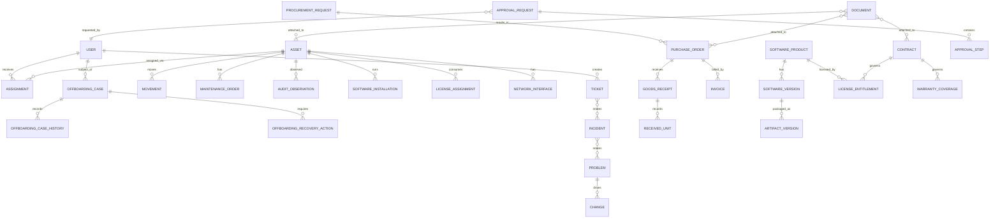

# DATA MODEL + ENTITY RELATIONSHIP SPEC
## IT Operations Hub — Canonical Data Model

**Version:** 0.1  
**Status:** Foundation Draft  
**Parent:** `SYSTEM_WORKFLOW_INDEX_TRACEABILITY_MATRIX.md`  
**Purpose:** Define canonical entities, aggregate boundaries, relationships, keys, history strategy, state storage, uniqueness rules, referential integrity, and cross-domain data ownership.

---

# 1. Mục tiêu

Tài liệu này chuyển hệ thống từ **workflow design** sang **data architecture**.

Mục tiêu chính:

```text
Workflow
→ Entity
→ Aggregate Root
→ Relationship
→ State
→ History
→ Constraint
→ Storage Boundary
```

Tài liệu phải trả lời:

1. Entity nào là nguồn dữ liệu chuẩn?
2. Entity nào là Aggregate Root?
3. Quan hệ nào là 1-1, 1-n, n-n?
4. Field nào mutable, field nào immutable?
5. Current state lưu ở đâu?
6. History / timeline / audit lưu ở đâu?
7. Khi nào dùng snapshot?
8. Khi nào dùng event history?
9. Unique constraint nào bắt buộc?
10. Foreign key nào nên strict?
11. Cross-domain reference xử lý thế nào?
12. Soft delete / archive / retention ra sao?
13. Làm sao tránh duplicate Asset/User/Ticket/Invoice?
14. Làm sao giữ lịch sử nhưng vẫn query nhanh?

---

# 2. Nguyên tắc thiết kế

## 2.1 Canonical Source of Truth

Mỗi loại dữ liệu có đúng một owner chính.

Ví dụ:

```text
Asset identity           → Asset domain
User employment context  → Identity domain
Ticket state             → Helpdesk domain
License entitlement      → License domain
Purchase order           → Procurement domain
Approval decision        → Approval engine
SLA state                → SLA engine
```

Các domain khác chỉ:

```text
reference
cache
snapshot
project
```

không sở hữu bản gốc.

---

## 2.2 Current State + History

Không dùng một bảng để vừa lưu current state vừa chứa toàn bộ lịch sử.

Pattern ưu tiên:

```text
CURRENT TABLE
+
HISTORY / EVENT TABLE
+
AUDIT TRAIL
```

Ví dụ:

```text
assets
asset_state_history
audit_events
```

---

## 2.3 Immutable Internal ID

Mọi entity chính có:

```text
id = immutable internal identifier
```

Display code chỉ để người dùng đọc:

```text
AST-2026-00042
TCK-2026-01234
INC-2026-00102
```

Display code không dùng làm primary key.

---

## 2.4 External IDs

Entity có thể map nhiều hệ thống ngoài:

```text
external_identity
external_reference
```

Ví dụ:

```text
Entra object ID
HR employee ID
Zabbix host ID
Slack user ID
Vendor invoice number
```

Không nhét tất cả vào một field `external_id`.

---

## 2.5 No Generic Status

Không dùng:

```text
status = "active"
```

cho mọi thứ.

State phải domain-specific.

Ví dụ Asset:

```text
lifecycle_state
operational_state
health_state
assignment_state
warranty_state
compliance_state
risk_state
```

---

# 3. Recommended Logical Storage

Không bắt buộc mỗi domain dùng DB riêng.

Logical recommendation:

```text
Relational Core
→ canonical entities / relationships / transactions

Event Store / Append-only Log
→ domain events / audit

Search Index
→ full-text / global search / operational lookup

Time-series Store
→ high-volume monitoring/telemetry

Object Storage
→ files/documents/artifacts/evidence
```

---

# 4. High-level Domain Map

```text
Identity
  ↓
Helpdesk / Incident
  ↓
Asset / Assignment / Location
  ↓
Maintenance / Audit / Network
  ↓
Software / License
  ↓
Procurement / Contract
  ↓
Control Plane
  ↓
Notification / Reporting / Audit
```

---

# 5. Aggregate Roots

| Domain | Aggregate Root | Important Children |
|---|---|---|
| Identity | User | ExternalIdentity, GroupMembership, RoleBinding |
| Identity | OffboardingCase | OffboardingCaseHistory, OffboardingRecoveryAction |
| Asset | Asset | Interface, StateHistory, AssetAttribute |
| Assignment | Assignment | AssignmentItem, Confirmation |
| Warehouse | GoodsReceipt | GoodsReceiptLine |
| Ticket | Ticket | Message, TicketRelation |
| Incident | Incident | IncidentEvent, IncidentRelation |
| Problem | Problem | RCA, KnownError, Workaround |
| Change | Change | ChangeTask, ApprovalRef, Verification |
| Maintenance | MaintenanceOrder | Diagnosis, PartUsage, RepairAction |
| Audit | Audit | AuditObservation, AuditException |
| Network | NetworkDevice / NetworkObservation | InterfaceObservation, TopologyEdge |
| Software | SoftwareProduct | SoftwareVersion, CatalogPolicy |
| Artifact | ArtifactVersion | ScanResult, SignatureResult |
| License | LicenseEntitlement | LicenseAssignment |
| Procurement | ProcurementRequest / PurchaseOrder | Lines, Amendments |
| Contract | Contract | ContractVersion, Coverage, RenewalCase |
| Invoice | Invoice | InvoiceLine, MatchResult |
| Approval | ApprovalRequest | ApprovalStep, Decision |
| SLA | SLAInstance | SLAEvent |
| Automation | AutomationRule | RuleVersion, Execution |
| Document | Document | DocumentVersion, Signature |
| Notification | Notification | DeliveryAttempt |
| Reporting | MetricDefinition | MetricSnapshot |

---

# 6. Core ERD Overview



---

# 7. Identity Domain

## 7.1 `users`

Canonical internal user record.

```yaml
users:
  id: uuid
  display_code:
  username:
  primary_email:
  display_name:
  employment_status:
  department_id:
  manager_user_id:
  location_id:
  cost_center_id:
  job_title:
  start_date:
  end_date:
  created_at:
  updated_at:
  archived_at:
```

### Constraints

```text
id UNIQUE PK
display_code UNIQUE
primary_email indexed
manager_user_id FK users.id nullable
```

Không bắt buộc `primary_email` globally unique nếu multi-tenant cho phép overlap.

---

## 7.2 `external_identities`

```yaml
external_identities:
  id:
  user_id:
  provider_id:
  provider_type:
  external_subject:
  external_tenant:
  username:
  email:
  last_synced_at:
  is_authoritative:
```

Unique:

```text
(provider_id, external_subject)
```

### Offboarding Case and Recovery Records

Identity owns the canonical Offboarding Case, its immutable history and
cancellation recovery records. Asset and License references remain logical
cross-domain references; Identity does not write their state.

```yaml
identity.offboarding_cases:
  id:
  tenant_id:
  user_id:
  state: # INITIATED, IN_PROGRESS, BLOCKED, READY_TO_CLOSE,
         # CANCELLATION_PENDING, COMPLETED, CANCELLED
  pre_offboarding_user_state:
  termination_request_id:
  termination_request_withdrawn_at:
  termination_request_withdrawal_reference:
  cancellation_requested_at:
  version:
  created_at:
  updated_at:
  completed_at:
  cancelled_at:

identity.user_lifecycle_history:
  id:
  tenant_id:
  user_id:
  from_state:
  to_state:
  actor_id:
  reason:
  correlation_id:
  occurred_at:

identity.offboarding_case_history:
  id:
  tenant_id:
  offboarding_case_id:
  case_version:
  from_state:
  to_state:
  command_type:
  actor_id:
  reason:
  correlation_id:
  occurred_at:

identity.offboarding_clearance_tasks:
  id:
  tenant_id:
  offboarding_case_id:
  clearance_type: # ACCESS, ASSET_RETURN, LICENSE
  resource_id:
  state: # PENDING, SUCCEEDED, BLOCKED, WAIVED, ACCEPTED_EXCEPTION
  detail:
  evidence_reference:
  authorized_by:
  version:

identity.offboarding_recovery_actions:
  id:
  tenant_id:
  offboarding_case_id:
  source_action_id:
  action_type:
  disposition: # PENDING, SUCCEEDED, WAIVED, ACCEPTED_EXCEPTION
  evidence_reference:
  authorized_by:
  reason:
  version:
  created_at:
  completed_at:

identity.offboarding_recovery_action_history:
  id:
  tenant_id:
  recovery_action_id:
  action_version:
  from_disposition:
  to_disposition:
  actor_id:
  reason:
  evidence_reference:
  occurred_at:
```

`pre_offboarding_user_state` is captured before the User Lifecycle transition
to `TERMINATING` and is immutable after the case begins. Recovery action
history is append-only; completed actions and irreversible data wipe/disposal
records are never deleted or rewritten. A `CANCELLED` case requires all
required recovery actions to be `SUCCEEDED` or explicitly policy-authorized as
`WAIVED` / `ACCEPTED_EXCEPTION`. Case version is the concurrency boundary for
`COMPLETE` versus `OFFBOARDING.REQUEST_CANCEL`. Validate termination-request
withdrawal and continued validity against its authoritative source at the
relevant command; do not treat a cached boolean as authoritative.

---

## 7.3 `departments`

```yaml
departments:
  id:
  name:
  parent_department_id:
  manager_user_id:
  cost_center_id:
  status:
```

Self-referencing hierarchy.

---

## 7.4 `groups`

```yaml
groups:
  id:
  name:
  type:
  source:
  external_group_id:
```

---

## 7.5 `group_memberships`

```yaml
group_memberships:
  group_id:
  user_id:
  source:
  valid_from:
  valid_until:
```

Unique active membership:

```text
(group_id, user_id, source)
```

---

## 7.6 `roles`

```yaml
roles:
  id:
  code:
  name:
  type:
  description:
  status:
```

---

## 7.7 `permissions`

```yaml
permissions:
  id:
  code:
  resource_type:
  action:
```

Example:

```text
asset.read
asset.assign
network.change_vlan
```

---

## 7.8 `role_permissions`

n-n:

```text
roles ↔ permissions
```

---

## 7.9 `role_bindings`

```yaml
role_bindings:
  id:
  principal_type:
  principal_id:
  role_id:
  scope_type:
  scope_id:
  source:
  valid_from:
  valid_until:
  revoked_at:
  version:
  reason:
  created_by:
```

No physical FK to polymorphic `principal_id` if multiple principal tables; enforce in application/domain layer.

---

# 8. Asset Domain

## 8.1 `assets`

Aggregate root.

```yaml
assets:
  id:
  asset_code:
  asset_model_id:
  serial_number:
  asset_tag:
  lifecycle_state:
  operational_state:
  health_state:
  assignment_state:
  warranty_state:
  compliance_state:
  risk_state:
  current_location_id:
  current_owner_user_id:
  acquisition_date:
  purchase_cost:
  currency:
  created_at:
  updated_at:
  retired_at:
  disposed_at:
```

`purchase_cost` and `currency` are derived read-model summaries, not canonical
financial history. Asset cost history is represented by immutable
CostProvenance/CostAllocation records linked to canonical commercial source
IDs, source versions and lines. Goods Receipt/received-unit references explain
physical lineage and are not cost authorities.

### Unique constraints

```text
asset_code UNIQUE
asset_tag UNIQUE when not null
```

Serial uniqueness:

```text
(manufacturer_id, serial_number)
```

or:

```text
(asset_model_id, serial_number)
```

depending manufacturer behavior.

---

## 8.2 `asset_models`

```yaml
asset_models:
  id:
  manufacturer_id:
  model_name:
  category_id:
  specifications_json:
  support_end_date:
```

---

## 8.3 `asset_categories`

Hierarchy:

```text
Computer
├─ Laptop
├─ Desktop
Server
Network
Monitor
Mobile
Peripheral
```

---

## 8.4 `asset_state_history`

Append-only.

```yaml
asset_state_history:
  id:
  asset_id:
  dimension:
  previous_value:
  new_value:
  changed_at:
  actor_type:
  actor_id:
  reason:
  workflow_id:
  correlation_id:
```

---

## 8.5 `asset_external_refs`

```yaml
asset_external_refs:
  asset_id:
  system:
  external_id:
  ref_type:
```

Example:

```text
Zabbix host ID
Intune device ID
Agent ID
Vendor asset ID
```

Unique:

```text
(system, external_id, ref_type)
```

---

# 9. Location Domain

## 9.1 `locations`

Single hierarchical structure.

```yaml
locations:
  id:
  code:
  name:
  type:
  parent_id:
  site_id:
  status:
```

Types:

```text
COUNTRY
SITE
BUILDING
FLOOR
ROOM
WAREHOUSE
RACK
SHELF
BIN
DESK
ZONE
```

---

## 9.2 `location_paths`

Optional closure table for fast hierarchy query.

```yaml
location_paths:
  ancestor_id:
  descendant_id:
  depth:
```

---

# 10. Assignment Domain

## 10.1 `assignments`

```yaml
assignments:
  id:
  asset_id:
  principal_type:
  principal_id:
  assignment_type:
  state:
  started_at:
  due_at:
  ended_at:
  source_request_id:
  handover_document_id:
  created_by:
```

Principal:

```text
USER
DEPARTMENT
LOCATION
PROJECT
```

But normal device assignment should prefer USER.

---

## 10.2 Active assignment uniqueness

For user-device asset:

```text
one asset
→ max one active primary assignment
```

Enforce via partial unique index where supported.

---

## 10.3 `assignment_history`

Can be derived from assignments themselves if immutable closed records.

Preferred:

```text
do not update past assignments after ended_at
```

except correction workflow.

## 10.4 `return_requests`

```yaml
return_requests:
  id:
  asset_id:
  assignment_id:
  user_id:
  due_at:
  reason:
  status: # PENDING, FULFILLED, CANCELLED
  cancelled_reason: # required for an explicit cancellation/compensation
  created_at:
  fulfilled_at:
```

Return request cancellation preserves the record and requires the Asset-owned
versioned command. Cancellation reason is retained to support idempotent
offboarding recovery; completed return requests are not rolled back.

---

# 11. Movement Domain

## 11.1 `movements`

```yaml
movements:
  id:
  asset_id:
  movement_type:
  from_location_id:
  to_location_id:
  from_principal_id:
  to_principal_id:
  state:
  started_at:
  completed_at:
  operation_id:
  reason:
  related_entity_type:
  related_entity_id:
```

Movement types:

```text
PUT_AWAY
ASSIGN
TRANSFER
RETURN
WAREHOUSE_TRANSFER
REPAIR_SEND
REPAIR_RETURN
DISPOSAL
```

---

# 12. Warehouse Domain

## 12.1 `warehouses`

```yaml
warehouses:
  id:
  location_id:
  name:
  status:
```

---

## 12.2 `goods_receipts`

Aggregate root.

```yaml
goods_receipts:
  id:
  receipt_code:
  supplier_id:
  purchase_order_id:
  warehouse_id:
  status:
  received_at:
  received_by:
  delivery_reference:
```

---

## 12.3 `goods_receipt_lines`

```yaml
goods_receipt_lines:
  id:
  goods_receipt_id:
  po_line_id:
  item_type:
  expected_qty:
  received_qty:
  accepted_qty:
  rejected_qty:
```

---

## 12.4 `received_serials`

```yaml
received_serials:
  id:
  goods_receipt_line_id:
  serial_number:
  asset_id:
  condition:
  disposition:
```

Unique:

```text
(goods_receipt_line_id, serial_number)
```

---

# 13. Ticket / Helpdesk Domain

## 13.1 `tickets`

```yaml
tickets:
  id:
  ticket_code:
  requester_user_id:
  type:
  category:
  priority:
  state:
  service_id:
  primary_asset_id:
  team_id:
  assignee_user_id:
  source_channel:
  summary:
  description:
  created_at:
  resolved_at:
  closed_at:
```

---

## 13.2 `ticket_messages`

```yaml
ticket_messages:
  id:
  ticket_id:
  direction:
  visibility:
  channel:
  external_message_id:
  sender_user_id:
  sender_external:
  body:
  created_at:
```

Unique:

```text
(channel, external_message_id)
```

when present.

---

## 13.3 `ticket_relations`

```yaml
ticket_relations:
  from_ticket_id:
  to_ticket_id:
  relation_type:
```

Types:

```text
DUPLICATE
PARENT
CHILD
RELATED
FOLLOW_UP
```

---

# 14. Incident Domain

## 14.1 `incidents`

```yaml
incidents:
  id:
  incident_code:
  type:
  priority:
  state:
  title:
  service_id:
  owner_team_id:
  incident_manager_user_id:
  root_incident_id:
  started_at:
  detected_at:
  restored_at:
  resolved_at:
```

---

## 14.2 `incident_entities`

n-n generic relation.

```yaml
incident_entities:
  incident_id:
  entity_type:
  entity_id:
  relation_type:
```

Examples:

```text
ASSET affected
USER affected
SERVICE affected
SITE affected
```

---

## 14.3 `incident_tickets`

```text
incidents ↔ tickets
```

---

## 14.4 `incident_events`

Append-only operational timeline for incident.

---

# 15. Service Domain

## 15.1 `services`

```yaml
services:
  id:
  code:
  name:
  criticality:
  owner_user_id:
  owner_team_id:
  status:
```

---

## 15.2 `service_dependencies`

```yaml
service_dependencies:
  service_id:
  depends_on_type:
  depends_on_id:
  criticality:
```

Can reference:

```text
SERVICE
ASSET
NETWORK_DEVICE
VLAN
CONTRACT
```

---

# 16. Problem Domain

## 16.1 `problems`

```yaml
problems:
  id:
  problem_code:
  title:
  state:
  priority:
  owner_user_id:
  service_id:
  problem_signature:
  created_at:
  resolved_at:
  closed_at:
```

Unique active signature may be enforced logically.

---

## 16.2 `problem_incidents`

n-n.

---

## 16.3 `root_cause_analyses`

```yaml
root_cause_analyses:
  id:
  problem_id:
  version:
  statement:
  root_cause:
  contributing_factors_json:
  prevention_json:
  approved_by:
  approved_at:
```

---

## 16.4 `known_errors`

```yaml
known_errors:
  id:
  problem_id:
  symptom:
  root_cause:
  workaround:
  risk:
  active:
```

---

# 17. Change Domain

## 17.1 `changes`

```yaml
changes:
  id:
  change_code:
  type:
  state:
  risk:
  impact:
  owner_user_id:
  source_problem_id:
  implementation_plan:
  test_plan:
  rollback_plan:
  scheduled_start:
  scheduled_end:
  actual_start:
  actual_end:
```

---

## 17.2 `change_tasks`

```yaml
change_tasks:
  id:
  change_id:
  sequence:
  title:
  type:
  state:
  assigned_team_id:
  result:
```

---

## 17.3 `change_entities`

n-n relation to impacted CI/assets/services/network objects.

---

# 18. Maintenance Domain

## 18.1 `maintenance_orders`

```yaml
maintenance_orders:
  id:
  maintenance_code:
  asset_id:
  state:
  maintenance_type:
  source_type:
  source_id:
  assigned_team_id:
  technician_user_id:
  opened_at:
  completed_at:
  total_cost:
  currency:
```

---

## 18.2 `diagnoses`

```yaml
diagnoses:
  id:
  maintenance_order_id:
  symptom:
  suspected_component:
  failure_mode:
  severity:
  result:
  confidence:
```

---

## 18.3 `repair_actions`

```yaml
repair_actions:
  id:
  maintenance_order_id:
  action_type:
  description:
  started_at:
  completed_at:
  result:
```

---

## 18.4 `part_usages`

```yaml
part_usages:
  id:
  maintenance_order_id:
  part_id:
  quantity:
  unit_cost:
```

---

# 19. Warranty Domain

## 19.1 `warranties`

```yaml
warranties:
  id:
  asset_id:
  provider_id:
  contract_id:
  start_date:
  end_date:
  coverage_type:
  state:
```

One asset can theoretically have multiple warranty records over time.

---

## 19.2 `warranty_claims`

```yaml
warranty_claims:
  id:
  warranty_id:
  maintenance_order_id:
  claim_number:
  state:
  submitted_at:
  expected_completion:
  actual_completion:
```

---

# 20. Replacement / Retirement / Disposal Domain

## 20.1 `replacement_plans`

```yaml
replacement_plans:
  id:
  asset_id:
  new_asset_id:
  target_user_id:
  target_model:
  score:
  reasons:
  assessment:
  budget:
  procurement_required:
  migration_required:
  review_date:
  risk_acceptance:
  reason:
  state:
  target_date:
  version:
```

---

## 20.2 `retirement_records`

```yaml
retirement_records:
  id:
  asset_id:
  reason:
  approval_id:
  clearances:
  state:
  version:
```

---

## 20.3 `data_wipe_jobs`

```yaml
data_wipe_jobs:
  id:
  asset_id:
  retirement_id:
  agent_id:
  method:
  state:
  generation:
  approval_id:
  started_at:
  completed_at:
  result:
  verification_result:
  evidence_document_id:
  evidence_storage_ref:
  evidence_checksum:
  report_key:
  version:
```

---

## 20.4 `disposal_records`

```yaml
disposal_records:
  id:
  asset_id:
  retirement_id:
  method:
  state:
  approval_id:
  cleanup_clearances:
  disposed_at:
  physical_evidence_id:
  physical_evidence_checksum:
  reason:
  version:
```

---

# 21. Audit Domain

## 21.1 `audits`

```yaml
audits:
  id:
  audit_code:
  type:
  scope_json:
  state:
  started_at:
  due_at:
  completed_at:
```

---

## 21.2 `audit_expected_assets`

Immutable snapshot.

```yaml
audit_expected_assets:
  audit_id:
  asset_id:
  expected_owner_id:
  expected_location_id:
  expected_state_json:
```

---

## 21.3 `audit_observations`

```yaml
audit_observations:
  id:
  audit_id:
  asset_id:
  source:
  observed_location_id:
  observed_owner_id:
  confidence:
  observed_at:
  evidence_json:
```

---

## 21.4 `audit_exceptions`

```yaml
audit_exceptions:
  id:
  audit_id:
  asset_id:
  type:
  severity:
  expected_json:
  observed_json:
  state:
  resolution:
```

---

# 22. Network Domain

## 22.1 `network_devices`

Can be extension of Asset.

Preferred:

```text
network_devices.asset_id UNIQUE
```

rather than duplicate physical device identity.

```yaml
network_devices:
  id:
  asset_id:
  management_ip:
  device_role:
  vendor:
  model:
```

---

## 22.2 `network_interfaces`

```yaml
network_interfaces:
  id:
  asset_id:
  network_device_id:
  interface_type:
  name:
  mac_address:
  is_primary:
```

---

## 22.3 `ip_addresses`

```yaml
ip_addresses:
  id:
  address:
  subnet_id:
  allocation_type:
  state:
```

Unique:

```text
(subnet_id, address)
```

---

## 22.4 `interface_ip_assignments`

Historical mapping.

```yaml
interface_ip_assignments:
  interface_id:
  ip_address_id:
  observed_from:
  valid_from:
  valid_to:
```

---

## 22.5 `vlans`

```yaml
vlans:
  id:
  site_id:
  vlan_number:
  name:
  purpose:
  security_zone:
  state:
```

Unique:

```text
(site_id, vlan_number)
```

---

## 22.6 `subnets`

```yaml
subnets:
  id:
  site_id:
  vlan_id:
  vrf_id:
  cidr:
  gateway:
```

Unique:

```text
(vrf_id, cidr)
```

---

## 22.7 `switch_ports`

```yaml
switch_ports:
  id:
  network_device_id:
  port_name:
  admin_state:
  operational_state:
  access_vlan_id:
  mode:
```

Unique:

```text
(network_device_id, port_name)
```

---

## 22.8 `network_observations`

High-volume, append-oriented.

```yaml
network_observations:
  id:
  source:
  observed_at:
  asset_id:
  mac:
  ip:
  vlan_id:
  switch_port_id:
  confidence:
```

May live outside transactional DB at scale.

---

## 22.9 `topology_edges`

```yaml
topology_edges:
  id:
  from_entity_type:
  from_entity_id:
  to_entity_type:
  to_entity_id:
  relation_type:
  source:
  confidence:
  observed_at:
  valid_until:
```

---

# 23. Software Domain

## 23.1 `software_products`

```yaml
software_products:
  id:
  name:
  vendor:
  category:
  classification:
  owner_user_id:
  license_required:
  state:
```

---

## 23.2 `software_versions`

```yaml
software_versions:
  id:
  software_product_id:
  version:
  release_date:
  support_state:
```

Unique:

```text
(software_product_id, version)
```

---

## 23.3 `software_installations`

```yaml
software_installations:
  id:
  asset_id:
  software_product_id:
  software_version_id:
  source:
  installed_at:
  last_seen_at:
  state:
```

Unique active:

```text
(asset_id, software_product_id, software_version_id)
```

depending package behavior.

## 23.4 `software.deployments`

Tenant-owned campaign aggregate containing the published software version,
active approved artifact, rollout stage, stop thresholds, retry limit, optional
approved Change reference, actor, reason, state, and optimistic version.

## 23.5 `software.deployment_targets`

One target per campaign and asset. Stores deterministic cohort order, bounded
attempt count, state, assigned enrolled-agent reference, expiring claim lease,
security-failure flag, last normalized error code, and optimistic version.

Required constraints:

```text
UNIQUE (tenant_id, campaign_id, asset_id)
UNIQUE (tenant_id, campaign_id, cohort_order)
```

## 23.6 `software.deployment_attempts`

Append-only normalized execution evidence per target attempt, including agent,
lease, precheck, checksum/signature booleans, installer exit, observed product
and version, reboot requirement, outcome, bounded error code, and redacted
summary. Updates and deletes are prohibited.

## 23.7 Inventory and Compliance Exceptions

Software owns `inventory_reports`, append-only `inventory_observations`,
`inventory_installations`, exact `product_aliases`, `software_exceptions` and
append-only `software_exception_history`. Inventory installation identity is
tenant + asset + normalized product/name, version, package identifier and
install scope; a detection generation distinguishes later reinstallation.
Exceptions reference the installation generation and retain state/version,
owner, risk, decision reason, approval reference and temporary expiry.

`uninstall_profiles` stores an approved symbolic method and explicit automatic
removal/no-business-dependency policy. `removal_jobs` and append-only
`removal_attempts` retain the enrolled Agent binding and expiring lease. Raw
commands and arbitrary URLs are not persisted or dispatched.

---

# 24. Artifact Domain

## 24.1 `artifact_versions`

```yaml
artifact_versions:
  id:
  software_version_id:
  filename:
  checksum_sha256:
  signature_state:
  scan_state:
  approval_state:
  storage_object_key:
  uploaded_at:
```

Unique:

```text
(checksum_sha256)
```

---

## 24.2 `artifact_scan_results`

Append-only:

```yaml
artifact_scan_results:
  id:
  artifact_version_id:
  scanner:
  scan_type:
  result:
  severity:
  scanned_at:
  report_document_id:
```

---

# 25. License Domain

## 25.1 `license_entitlements`

```yaml
license_entitlements:
  id:
  software_product_id:
  contract_id:
  license_type:
  quantity:
  valid_from:
  valid_until:
  pool_id:
  cost_summary: # derived from immutable CostProvenance/CostAllocation
  currency_summary:
  # effective_state is derived from valid_from/valid_until; never manually stored.
  # Compliance state is a separate calculated projection (State Machine §56).
```

Entitlement terms that are renewed or corrected must retain prior term
snapshots in append-only License-owned history. `effective_state` is derived
using the validity interval defined in the Software/License workflow. It is not
the assignment state and is not the compliance projection. Do not add a
manually mutable generic `state` field to the canonical entitlement record.
License Entitlement and Pool cost summaries are projections from immutable
cost provenance; they are not overwritten financial source records. Keep
provenance at the Entitlement/Pool or commercial entitlement-unit level unless
an explicit policy allocates cost to assignments.

---

## 25.2 `license_pools`

```yaml
license_pools:
  id:
  name:
  department_id:
  business_unit_id:
  contract_id:
```

---

## 25.3 `license_assignments`

```yaml
license_assignments:
  id:
  entitlement_id:
  reservation_id:
  principal_type:
  principal_id:
  quantity:
  state:
  version:
  assigned_at:
  activated_at:
  cancelled_at:
  reclaimed_at:
  reclaim_verification_reference:
```

License assignments and deployment reservations are License-owned. A typed
principal reference is validated through the owning Identity or Asset
application boundary; License does not mutate those domains. Assignment and
reservation histories are append-only. `usage_observations` preserve the
source, observation time, active-use count, optional inactivity threshold, and
evidence reference used by compliance projections. Assignment states include
`ASSIGNED`, `ACTIVE`, `SUSPENDED`, `RECLAIM_PENDING`, `RECLAIMED`, `EXPIRED`,
and `CANCELLED`. `CANCELLED` requires `cancelled_at`, requires
`activated_at IS NULL`, is terminal, and is excluded from capacity counts and
the one-live-principal constraint. Only an unactivated `ASSIGNED` record may
be cancelled through `LICENSE.CANCEL_ASSIGNMENT`; no assignment row or history
is deleted.

---

## 25.4 `software_usage_snapshots`

```yaml
software_usage_snapshots:
  id:
  principal_type:
  principal_id:
  software_product_id:
  observed_at:
  usage_metric:
  usage_value:
```

---

# 26. Procurement Domain

## 26.1 `procurement_requests`

```yaml
procurement_requests:
  id:
  request_code:
  requester_user_id:
  source_type:
  source_id:
  state:
  business_reason:
  cost_center_id:
  project_id:
  target_date:
  estimated_total:
  currency:
```

---

## 26.2 `procurement_request_lines`

```yaml
procurement_request_lines:
  id:
  procurement_request_id:
  item_type:
  item_reference_id:
  description:
  quantity:
  estimated_unit_price:
```

---

# 27. Supplier / RFQ Domain

## 27.1 `suppliers`

```yaml
suppliers:
  id:
  code:
  legal_name:
  tax_identifier:
  state:
  version:  # optimistic concurrency across profile and lifecycle changes
  risk_state:
  created_at:
  updated_at:
```

`state` is one of `PROSPECT`, `APPROVED`, `PREFERRED`, `SUSPENDED`, `BLOCKED`
or `INACTIVE`. Do not persist a separate `preferred` boolean; preference is
derived from `state = PREFERRED`. `version` starts at 1 and increments on every
successful mutation. Supplier state/profile history is append-only and records
actor, before/after values (or changed-field names for protected fields),
reason where required, versions, correlation and command identity. Supplier
records are not hard-deleted; commercial foreign references remain valid.

---

## 27.2 `rfqs`

```yaml
rfqs:
  id:
  tenant_id:
  rfq_code:
  procurement_request_id:
  state:
  version:
  commercial_terms:
  created_by:
  created_at:
  updated_at:
  issued_at:
  due_at:
```

`state` is one of `DRAFT`, `OPEN`, `EVALUATING`, `AWARDED`,
`CLOSED_NO_AWARD` or `CANCELLED`. `version` is positive, starts at 1 and
increments for every committed change. Persist append-only RFQ history with
actor, command, before/after state/terms, reason when required, version,
correlation ID and timestamp. RFQ commercial terms and candidate membership
are mutable only while `DRAFT`; after issue, material changes require a new
RFQ. The RFQ row is the serialization root for submission-close,
award-cancel and same-supplier submission races.

## 27.2.1 `rfq_suppliers`

```yaml
rfq_suppliers:
  tenant_id:
  rfq_id:
  supplier_id:
  created_at:
```

Use a tenant-bound join table for RFQ supplier participation; enforce unique
`(tenant_id, rfq_id, supplier_id)` and same-tenant foreign keys to the RFQ and
Supplier. Revalidate current Supplier eligibility when the RFQ is issued.

---

## 27.3 `quotations`

```yaml
quotations:
  id:
  tenant_id:
  rfq_id:
  supplier_id:
  quote_number:
  currency:
  valid_until:
  lead_time_days:
  payment_terms:
  warranty:
  delivery_terms:
  lines:
  attachments:
  state:
  version:
  revision_number:
  replaces_quotation_id:
  created_at:
  submitted_at:
```

`state` is one of `DRAFT`, `SUBMITTED`, `WITHDRAWN`, `DISQUALIFIED`,
`ACCEPTED`, `REJECTED` or `VOID`. A submitted quotation is immutable. A
revision is a new row linked to the withdrawn prior quotation through
`replaces_quotation_id`; retain the prior commercial values and history. The
revision link must remain within the same tenant, RFQ and Supplier, and
`revision_number` is positive and unique within that tenant/RFQ/Supplier.
The replaced quotation must be a prior `WITHDRAWN` revision.

Enforce at most one current `SUBMITTED` quotation per tenant/RFQ/Supplier with
a partial unique constraint on `(tenant_id, rfq_id, supplier_id)` while
`state = 'SUBMITTED'`. Keep all quotation transitions in append-only history.
RFQ parent decisions update child quotation states and their versions in the
same transaction; RFQ cancellation changes only child quotations currently in
`DRAFT` or `SUBMITTED`, never terminal quotation history. Award accepts the
selected submission, rejects other `SUBMITTED` rows and changes remaining
`DRAFT` rows to `VOID`. Close-no-award rejects `SUBMITTED` rows and changes
remaining `DRAFT` rows to `VOID`. Every terminal RFQ therefore has only
terminal child quotations.

---

# 28. Purchase Order Domain

## 28.1 `purchase_orders`

```yaml
purchase_orders:
  tenant_id:
  id:
  po_code:
  procurement_request_id:
  supplier_id:
  rfq_id:
  accepted_quotation_id:
  lifecycle_state: DRAFT | ISSUED | ON_HOLD | CLOSED | CANCELLED
  receipt_state: NOT_RECEIVED | PARTIALLY_RECEIVED | FULLY_RECEIVED
  aggregate_version:
  current_commercial_version: # null until issue; 1 at initial issue
  issue_approval_request_id: # nullable authoritative current PO_ISSUE link
  currency:
  contract_id:
  issued_at:
  expected_delivery:
  created_at:
  updated_at:
```

`lifecycle_state` and `receipt_state` are independent dimensions. Approval is
not a lifecycle state. `CLOSED` and `CANCELLED` are terminal lifecycle states;
`PARTIALLY_RECEIVED` and `FULLY_RECEIVED` exist only in `receipt_state`.
Initial creation sets `DRAFT` and `NOT_RECEIVED`. Existing-aggregate commands
increment `aggregate_version`; expected-version checks fence all writes.

Tenant-bound RFQ/Quotation relationships are optional. If `rfq_id` is
present, `accepted_quotation_id` must be from that RFQ, be the accepted award
quotation, and have the same Supplier as the PO. `issue_approval_request_id`
is the authoritative current link for the optional PO_ISSUE approval gate;
the Approval Engine sets/replaces that link through its application contract.
Superseded approval records remain in approval history and are not rewritten.
PO, Supplier, Procurement Request, RFQ, Quotation and current Approval Request
references use tenant-bound composite keys. Enforce the enumerated lifecycle
and receipt-state values at the storage boundary. PO records are never
hard-deleted.

## 28.2 `purchase_order_versions` — Immutable Commercial History

Each issued commercial version is immutable and is never updated or deleted.
`PO.ISSUE` creates version 1; each permitted `PO.AMEND` creates the next
version. Aggregate lifecycle/receipt transitions increment
`purchase_orders.aggregate_version` but do not create a commercial version.

```yaml
purchase_order_versions:
  tenant_id:
  purchase_order_id:
  commercial_version:
  base_aggregate_version:
  change_kind: INITIAL_ISSUE | AMENDMENT
  canonical_snapshot:
  snapshot_hash:
  approval_request_id:
  actor_id:
  reason:
  correlation_id:
  created_at:
```

Unique key: `(tenant_id, purchase_order_id, commercial_version)`. The
canonical snapshot includes Supplier and source references, currency, all
commercial terms/delivery fields, and complete PO line data. `snapshot_hash`
is computed from normalized canonical content and binds Approval Engine
context. An amendment version records the base aggregate/commercial version
and proposed resulting snapshot. Historical snapshots and their hashes remain
append-only.

Database invariants require the PO current-version pointer to reference an
existing immutable version once the PO has been issued; it may remain null
only for a PO that has never been issued (including a cancelled draft).
Prohibit update/delete of committed version snapshots/lines and lifecycle
transitions out of `CLOSED` or `CANCELLED`. Receipt state is monotonic and
cannot regress. PO cancellation checks the canonical Goods Receipt ledger
while serialized on the PO aggregate; the denormalized `NOT_RECEIVED` value
alone is insufficient.

## 28.3 `purchase_order_lines`

```yaml
purchase_order_lines:
  tenant_id:
  id:
  purchase_order_id:
  commercial_version: # null only for mutable DRAFT working lines
  line_no:
  item_type:
  item_reference_id:
  description:
  unit:
  quantity:
  unit_price:
  tax_amount:
  discount_amount:
  expected_delivery:
```

Draft working lines may change only through `PO.UPDATE_DRAFT`. Once an issued
commercial version is committed, its line set is immutable and version-bound.
An amendment adds lines to the new commercial version; it never rewrites old
version lines. Receipt/invoice quantities belong to their owning receipt and
invoice ledgers/projections and must not mutate commercial version lines.

## 28.4 `purchase_order_history` and Receipt Relationship

PO lifecycle, amendment and receipt-state changes require append-only history
with this minimum shape:

```yaml
purchase_order_history:
  id:
  tenant_id:
  purchase_order_id:
  aggregate_version:
  command:
  previous_lifecycle_state:
  lifecycle_state:
  previous_receipt_state:
  receipt_state:
  before_snapshot:
  after_snapshot:
  actor_id:
  reason:
  correlation_id:
  occurred_at:
```

Unique key: `(tenant_id, purchase_order_id, aggregate_version)`. Updates and
deletes are forbidden. Every committed state-changing PO command appends one
history row in the same transaction as the PO mutation and outbox/audit
references. A short close preserves every receipt record and quantity; it only
records that the remaining balance was intentionally closed.

Goods Receipt records remain owned by Procurement/Warehouse receiving under
TASK-073. Each posted receipt line references the tenant, PO, committed
commercial version and PO line version it fulfills. Receipt POST updates PO
accepted counters, summaries, receipt state and aggregate history while
serialized on the PO aggregate. Receipt state can progress
`NOT_RECEIVED → PARTIALLY_RECEIVED/FULLY_RECEIVED`, remain partial after a
later partial receipt, or progress from partial to full; it never rewrites a
commercial version or PO lifecycle state. Only accepted quantity counts and
cumulative accepted quantity cannot exceed the issued PO line quantity.

Procurement owns receipt records and must not directly create/update Asset
tables. The receipt-to-Asset relationship is an asynchronous registration
reference processed after commit through the Asset-owned
`ASSET.REGISTER_RECEIVED` application command.

## 28.5 `goods_receipts`, Lines, Units and Exceptions

Goods Receipt lifecycle is `DRAFT | POSTED | CANCELLED`; POSTED and CANCELLED
are terminal. Never hard-delete a receipt. A posted receipt is immutable; a
future correction/reversal requires a separate compensating workflow.

```yaml
goods_receipts:
  id:
  tenant_id:
  receipt_code:
  state: DRAFT | POSTED | CANCELLED
  aggregate_version:
  purchase_order_id:
  purchase_order_code_snapshot:
  purchase_order_commercial_version:
  supplier_id:
  supplier_display_snapshot:
  warehouse_id:
  location_id:
  receiving_actor_id:
  received_at:
  posted_at:
  cancelled_at:
  cancellation_reason:
  immutable_posted_snapshot:
  correlation_id:
  created_at:
  updated_at:
```

```yaml
goods_receipt_lines:
  id:
  tenant_id:
  goods_receipt_id:
  purchase_order_id:
  purchase_order_line_id:
  commercial_version:
  ordered_quantity_snapshot:
  previously_accepted_quantity_at_post:
  observed_quantity:
  accepted_quantity:
  rejected_or_damaged_quantity:
  unit:
  item_reference_id:
  description_snapshot:
  evidence_document_refs:
```

```yaml
goods_receipt_units:
  id: # immutable received_unit_id
  tenant_id:
  goods_receipt_id:
  goods_receipt_line_id:
  identity_type:
  identity_value:
  serial_number:
  accepted:
  condition:
  evidence_refs:
```

For serialized/Asset-tracked accepted quantity, persist one immutable unit
identity per accepted physical unit before POST. Enforce no duplicate
normalized unit identity within one receipt. Serial number is not a globally
unique Asset primary key. Existing Asset matches use Asset-owned duplicate
handling; ambiguity creates an exception/human review and never an automatic
merge.

Tenant-bound composite references must ensure receipt lines point to the
receipt's PO and an existing PO line in the pinned commercial version; the
receipt Supplier must match the PO Supplier. Enforce positive accepted
quantity for posted lines and a PO-serialized cumulative accepted quantity
no greater than ordered quantity. Permit draft edits only while DRAFT. Reject
all update/delete attempts against POSTED receipt facts and all hard deletes
of receipt records. A POSTED immutable snapshot must preserve PO code/version,
Supplier display reference, receiving location, quantity context, unit
identities, actor/timestamps and evidence references.

```yaml
receiving_exceptions:
  id:
  tenant_id:
  goods_receipt_id:
  goods_receipt_line_id:
  received_unit_id:
  exception_type:
  blocking:
  status:
  observed_facts:
  evidence_refs:
  created_at:
```

An unresolved blocking exception that makes accepted quantity or item
identity uncertain prevents POST. TASK-073 does not define a full
quarantine-resolution workflow. Only POSTED receipts contribute accepted
quantities to invoice 3-Way Match; DRAFT and CANCELLED receipts do not.

`procurement.receipt_assetization_state` may retain non-authoritative retry
and projection status; it never changes a posted receipt fact. Asset owns
`asset.received_unit_registrations`, an immutable mapping from each received
unit ID to at most one Asset. Procurement never writes Asset tables.

POST atomically changes receipt state to POSTED, freezes its snapshot/lines/
units, updates PO accepted counters and receipt summaries/state/version/
history, and writes audit/outbox. The PO row/aggregate lock and database
invariants must protect cumulative accepted quantities against parallel
POSTs. All validation failure leaves these effects uncommitted.


---

# 29. Invoice, Match and Credit Note Domain (TASK-074)

## 29.1 `invoices`

```yaml
invoices:
  id:
  tenant_id:
  supplier_id:
  supplier_document_number_original:
  supplier_document_number_normalized:
  document_type: INVOICE
  purchase_order_id:
  lifecycle_state: DRAFT | SUBMITTED | APPROVED | REJECTED | CANCELLED
  match_status: NOT_EVALUATED | PENDING_RECEIPT | MATCHED | MISMATCHED
  derived_credit_status: NONE | PARTIALLY_CREDITED | FULLY_CREDITED
  current_match_evaluation_id:
  submitted_snapshot_json:
  snapshot_fingerprint:
  invoice_date:
  currency:
  net_amount:
  tax_amount:
  gross_amount:
  version:
  created_at:
  submitted_at:

invoice_history:
  id:
  tenant_id:
  invoice_id:
  prior_lifecycle_state:
  new_lifecycle_state:
  version:
  actor_id:
  reason_code:
  correlation_id:
  created_at:
```

Draft fields are editable only in `DRAFT`. Submission freezes the complete
commercial snapshot. Store tenant, supplier, PO and evidence references so
historical match explanation does not depend on mutable display data.

## 29.2 `invoice_lines`

```yaml
invoice_lines:
  id:
  tenant_id:
  invoice_id:
  po_line_id:
  description_snapshot:
  quantity:
  unit_price:
  currency:
  tax_amount:
  charge_amount:
  line_total:
  evidence_reference_ids:
```

Submitted line values and references are immutable. Draft line changes are
transactional with the Invoice aggregate version.

## 29.3 `invoice_document_identity_reservations`

```yaml
invoice_document_identity_reservations:
  tenant_id:
  supplier_id:
  document_type: INVOICE | CREDIT_NOTE
  supplier_document_number_normalized:
  document_id:
  reserved_at:
```

Primary/unique identity is
`(tenant_id, supplier_id, document_type, supplier_document_number_normalized)`.
The reservation is inserted in the Invoice/Credit Note submit transaction and is
retained after submission, including when the document later becomes terminal.
Drafts have no reservation. NFKC, trim, repeated-whitespace collapse and case
normalization derive the normalized number; punctuation is preserved.

## 29.4 `invoice_match_evaluations`

```yaml
invoice_match_evaluations:
  id:
  tenant_id:
  invoice_id:
  evaluation_version:
  invoice_snapshot_fingerprint:
  po_commercial_version:
  receipt_evidence_fingerprint:
  match_status: PENDING_RECEIPT | MATCHED | MISMATCHED
  reason_codes:
  expected_values_json:
  observed_values_json:
  evaluated_at:
  correlation_id:
```

Evaluations are append-only. A current-evaluation pointer may be maintained
on the Invoice aggregate, but must not replace historical records.

## 29.5 `invoice_match_allocations`

```yaml
invoice_match_allocations:
  id:
  tenant_id:
  invoice_id:
  invoice_line_id:
  po_id:
  po_line_id:
  goods_receipt_id: nullable
  goods_receipt_line_id: nullable
  allocation_kind: RECEIPT_MATCHED | APPROVED_EXCEPTION
  quantity:
  amount:
  match_evaluation_id:
  approval_request_id: nullable
  credit_released_quantity:
  credit_released_amount:
  created_at:
```

A `RECEIPT_MATCHED` allocation references immutable POSTED accepted receipt
evidence. An `APPROVED_EXCEPTION` allocation reserves the full approved
invoice-line quantity against reuse by later invoices, including any
portion lacking receipt evidence; it remains explicitly distinct from a
matched Goods Receipt allocation and does not change `MISMATCHED` status. Both
kinds serialize against the PO line and are included in net invoiceable
capacity. Applied Credit Notes append release facts; they do not edit the
original allocation.

## 29.6 `invoice_match_exceptions` and history

```yaml
invoice_match_exceptions:
  id:
  tenant_id:
  invoice_id:
  purchase_order_id:
  match_evaluation_id:
  reason_codes:
  expected_values_json:
  observed_values_json:
  status:
  resolution_reference:
  version:

invoice_match_exception_history:
  id:
  tenant_id:
  exception_id:
  prior_status:
  new_status:
  reason:
  actor_id:
  approval_request_id:
  correlation_id:
  created_at:
```

Mismatch evidence is immutable. Resolution and exception acceptance are
append-only history. Exception approval binds to the exact invoice snapshot
and current match evaluation fingerprint.

## 29.7 `credit_notes`, lines and applications

```yaml
credit_notes:
  id:
  tenant_id:
  supplier_id:
  document_type: CREDIT_NOTE
  supplier_document_number_original:
  supplier_document_number_normalized:
  invoice_id:
  lifecycle_state: DRAFT | SUBMITTED | APPLIED | REJECTED | CANCELLED
  submitted_snapshot_json:
  snapshot_fingerprint:
  currency:
  total_amount:
  version:

credit_note_history:
  id:
  tenant_id:
  credit_note_id:
  prior_lifecycle_state:
  new_lifecycle_state:
  version:
  actor_id:
  reason_code:
  correlation_id:
  created_at:

credit_note_lines:
  id:
  tenant_id:
  credit_note_id:
  invoice_line_id:
  quantity:
  amount:
  reason_code:

credit_note_applications:
  id:
  tenant_id:
  credit_note_id:
  invoice_id:
  invoice_line_id:
  quantity:
  amount:
  applied_at:
  correlation_id:
```

Credit quantities and amounts are positive semantic values. An application is
unique per submitted Credit Note and is committed exactly once. DB constraints
and PO-line/invoice-line serialization prevent cumulative applications from
exceeding the remaining creditable quantity/amount. The application writes
credited quantity/amount facts and releases invoiceable quantity only when
explicitly credited line quantity had consumed that capacity. It never
modifies the Invoice, PO,
Goods Receipt or original match allocation.

Credit status is derived independently as `NONE`, `PARTIALLY_CREDITED` or
`FULLY_CREDITED` from immutable Invoice and applied Credit Note/application
facts.

## 29.8 Invariants and Concurrency

- A unique submitted document identity reservation enforces hard duplicate
  protection for Invoice and Credit Note; duplicate submit maps to
  `INVOICE_DUPLICATE`.
- Net `RECEIPT_MATCHED` allocations against each PO line cannot exceed
  accepted POSTED receipt quantity after applied credit releases.
  `APPROVED_EXCEPTION` reservations are recorded separately and also consume
  future invoiceable capacity even when `match_status` remains `MISMATCHED`;
  unsupported exception quantity is never represented as received quantity.
- Exception-approved quantity is reserved in full to prevent later invoice
  reuse; receipt-supported allocations and unsupported-but-approved
  reservations retain separate `allocation_kind` and approval references.
  Match status/evaluation facts are unchanged by reservation.
- Concurrent submissions, re-evaluations, approvals and credit applications
  serialize on the affected document/PO-line allocation identity. A database
  invariant prevents two invoices from allocating the same remaining
  quantity or two Credit Notes from over-crediting the same Invoice line.
- Concurrent re-evaluation and Goods Receipt projection/update must read
  canonical PO counters or an equivalently serialized canonical receipt
  projection; stale evidence cannot commit an allocation.
- Audit/outbox and allocation/application effects commit atomically with the
  owning command. Timeline and heuristic duplicate candidates are projections.

---

# 30. Contract Domain

## 30.1 `contracts`

```yaml
contracts:
  id:
  contract_code:
  supplier_id:
  type:
  lifecycle_state: # DRAFT | PENDING_SIGNATURE | EXECUTED | ACTIVE | EXPIRED | TERMINATED | CANCELLED
  usage_status: # ENABLED | ON_HOLD; independent from lifecycle
  current_version_id:
  effective_at:
  end_at:
  auto_renew:
  renewal_notice_date:
  renewal_notice_period_days:
  owner_user_id:
  business_owner_user_id:
  value:
  currency:
  renewed_from_contract_id:
  version:
  created_at:
  updated_at:
```

Invariants:

```text
effective_at < end_at
supplier_id is immutable after execution
terminal lifecycle: EXPIRED | TERMINATED | CANCELLED
only EXECUTED or ACTIVE Contracts may be amended
```

---

## 30.2 `contract_versions`

Each material commercial proposal is an immutable version. Contract identity
stores a current-version reference; versions preserve the exact terms that
were submitted, executed or amended.

```yaml
contract_versions:
  id:
  tenant_id:
  contract_id:
  version_number:
  commercial_snapshot:
  snapshot_fingerprint:
  base_version_id:
  changed_field_names:
  source: # DRAFT | EXECUTION | AMENDMENT | RENEWAL
  reason:
  created_by:
  created_at:
  evidence_document_version_ids:
```

Unique `(tenant_id, contract_id, version_number)`. A version submitted for
signature or executed is never rewritten. Execution evidence and approval
context reference the exact version ID/fingerprint. Amendment creates a new
version and append-only changed-field history; renewal creates a successor
Contract instead of modifying the predecessor's end date.

The immutable `commercial_snapshot` binds `renewal_notice_date`,
`renewal_notice_period_days`, auto-renew semantics and other renewal terms to
the exact version. If both explicit date and period are present, the date is
authoritative. Otherwise derive the trigger from `end_at -
renewal_notice_period_days`. No global threshold is inferred. Material term
changes schedule future alerts against the new version; prior alert facts are
retained. TASK-075 amendment scope remains authoritative and is not expanded
by this alert rule.

---

## 30.3 `contract_coverages`

Generic relation:

```yaml
contract_coverages:
  contract_id:
  entity_type:
  entity_id:
  coverage_type:
  valid_from:
  valid_to:
```

## 30.4 `renewal_cases`

```yaml
renewal_cases:
  id:
  tenant_id:
  predecessor_contract_id:
  successor_contract_id:
  lifecycle_state: # OPEN | COMPLETED | NOT_RENEWED | CANCELLED
  proposal_snapshot:
  proposal_fingerprint:
  version:
  reason:
  created_by:
  created_at:
  updated_at:
```

Durably enforce at most one OPEN Renewal Case per predecessor and at most one
canonical successor Contract per Renewal Case. `CANCELLED` means erroneous or
abandoned process; `NOT_RENEWED` means explicit business decision. Completion
requires successor Contract lifecycle EXECUTED or ACTIVE. The successor stores
`renewed_from_contract_id`; its term starts at or after predecessor `end_at`
unless an explicit future policy permits overlap.

Execution evidence must bind the exact ContractVersion and be stored as
governed document references. Approval requests remain independently owned by
Approval Engine and bind Contract/Version/Renewal proposal context; they are
not execution evidence.

---

# 31. Document Domain

## 31.1 `documents`

```yaml
documents:
  id:
  document_code:
  type:
  title:
  governance_status: # DRAFT | FINAL | SUPERSEDED | VOID
  signature_status: # NONE | PENDING | PARTIALLY_SIGNED | SIGNED | DECLINED
  confidentiality:
  owner_user_id:
  effective_date:
  expiry_date:
  retention_policy_id:
```

---

## 31.2 `document_versions`

```yaml
document_versions:
  id:
  document_id:
  version:
  storage_object_key:
  checksum_sha256:
  content_type:
  size_bytes:
  created_by:
  created_at:
  classification:
  access_policy_ref:
  governance_status:
  signature_status:
  finalized_at:
```

Unique:

```text
(document_id, version)
```

Document governance and signature/execution are independent dimensions.
FINAL content is immutable; content replacement creates a new version and
storage object key. SUPERSEDED retains the prior version and references its
replacement. VOID is only for eligible erroneous pre-execution evidence.
Commercial documents use the central document metadata/object-storage model;
they do not introduce a parallel file store.

---

## 31.3 `document_links`

Generic n-n:

```yaml
document_links:
  document_id:
  entity_type:
  entity_id:
  relation_type:
```

---

# 32. Approval Domain

## 32.1 `approval_requests`

```yaml
approval_requests:
  id:
  source_type:
  source_id:
  policy_id:
  policy_version:
  requester_user_id:
  state:
  current_step_no:
  context_snapshot_json:
  created_at:
  due_at:
```

---

## 32.2 `approval_steps`

```yaml
approval_steps:
  id:
  approval_request_id:
  step_no:
  routing_type:
  state:
  required_count:
```

---

## 32.3 `approval_step_assignees`

```yaml
approval_step_assignees:
  approval_step_id:
  approver_type:
  approver_id:
  decision:
  decided_at:
  reason:
```

---

# 33. SLA Domain

## 33.1 `sla_policies`

```yaml
sla_policies:
  id:
  code:
  object_type:
  version:
  state:
  calendar_id:
```

---

## 33.2 `sla_targets`

```yaml
sla_targets:
  id:
  sla_policy_id:
  name:
  duration_minutes:
  start_condition:
  stop_condition:
```

---

## 33.3 `sla_instances`

```yaml
sla_instances:
  id:
  object_type:
  object_id:
  target_id:
  policy_version:
  state:
  started_at:
  due_at:
  paused_duration_seconds:
  completed_at:
```

---

## 33.4 `sla_events`

Append-only:

```text
START
PAUSE
RESUME
WARNING
BREACH
MET
```

---

# 34. Automation Domain

## 34.1 `automation_rules`

```yaml
automation_rules:
  id:
  code:
  name:
  owner_user_id:
  state:
  current_version:
  safety_level:
```

---

## 34.2 `automation_rule_versions`

```yaml
automation_rule_versions:
  id:
  automation_rule_id:
  version:
  trigger_json:
  condition_json:
  action_json:
  retry_policy_json:
  rollback_policy_json:
  created_at:
```

---

## 34.3 `rule_executions` — TASK-091 execution record

```yaml
rule_executions:
  id:
  tenant_id:
  rule_version_id:
  trigger_event_id:
  correlation_id:
  target_type:
  target_id:
  action_intent_id:
  state:
  started_at:
  completed_at:
```

## 34.4 TASK-090 Rule Version and Action Intent Contract

The canonical owner is the Automation domain. Names below are logical
entities; repository naming conventions may adjust table names without
changing the invariants.

```yaml
automation.rules:
  id:
  tenant_id:
  code:
  name:
  owner_user_id:
  owner_team_id:
  purpose:
  review_date:
  state: DRAFT | ACTIVE | INACTIVE
  active_version_id:
  draft_version_id:
  version:
  created_at:
  updated_at:

automation.rule_versions:
  id:
  tenant_id:
  rule_id:
  version:
  state: DRAFT | PUBLISHED
  trigger_json:       # EVENT only for TASK-090
  condition_json:
  action_json:
  priority:           # immutable version metadata; evaluation order only
  safety_level:
  requires_approval:
  activation_approval_id: # required when high-risk activation policy applies
  activation_context_hash:
  content_hash:
  created_by:
  created_at:
  published_by:
  published_at:

automation.rule_evaluations:
  id:
  tenant_id:
  source_event_id:
  source_event_type:
  rule_id:
  rule_version:
  mode: PRODUCTION | SIMULATION
  match_result:
  condition_evidence_json:
  action_capability_id:
  action_capability_version:
  action_policy_id:
  action_policy_version:
  automation_principal_id:
  authorization_permission:
  authorization_scope_reference:
  authorization_decision: ALLOW | DENY
  policy_decision: ALLOW | DENY | REQUIRE_APPROVAL
  policy_reason_code:
  kill_switch_decision:
  conflict_decision:
  approval_context_hash:
  context_hash:
  action_intent_ids:
  correlation_id:
  created_at:

automation.action_intents:
  id:
  tenant_id:
  source_event_id:
  target_type:
  target_id:
  action_domain:
  action_type:
  normalized_parameters_json:
  action_capability_id:
  action_capability_version:
  action_policy_id:
  action_policy_version:
  automation_principal_id:
  authorization_permission:
  authorization_scope_reference:
  authorization_decision: ALLOW | DENY
  policy_decision:
  approval_id:
  approval_context_hash:
  deduplication_key:
  conflict_scope_key:
  state: READY | PENDING_APPROVAL | BLOCKED | CONFLICTED | CANCELLED |
         EXECUTING | SUCCEEDED | FAILED
  reason_code:
  correlation_id:
  created_at:

automation.action_intent_contributors:
  tenant_id:
  action_intent_id:
  rule_id:
  rule_version:
  evaluation_id:
  created_at:

automation.intent_conflicts:
  id:
  tenant_id:
  conflict_scope_key:
  state: OPEN | RESOLVED
  resolution:
  resolved_by:
  resolution_reason:
  created_at:
  resolved_at:

automation.intent_conflict_members:
  tenant_id:
  conflict_id:
  action_intent_id:
  resolution_state:
  created_at:

automation.action_capabilities: # canonical allow-listed catalog entry/version
  id:
  version:
  action_type:
  target_type:
  required_permission:
  safety_class: SAFE_AUTOMATION | CONTROLLED | HIGH_RISK | PROHIBITED
  automatic_execution_supported:
  approval_allowed:
  approval_required_by_capability:
  conflict_group:
  parameter_schema_json: # typed/allow-listed; never executable code
  executor_type:
  active:
  content_hash:

automation.action_policies:
  id:
  tenant_id:
  action_type:
  target_type:
  version:
  mode: DENY | ALLOW | REQUIRE_APPROVAL
  resource_scope_json:
  parameter_constraints_json:
  approval_requirement:
  active:
  effective_from:
  effective_to:
  created_by:
  changed_by:
  reason:
  audit_reference:
  created_at:
  published_at:

authorization.automation_principals: # canonical service identity
  id:
  principal_type: SYSTEM_AUTOMATION
  service_identity:
  active:

authorization.automation_principal_grants:
  id:
  tenant_id:
  principal_id:
  permission_or_capability:
  resource_scope_json:
  active:
  valid_from:
  valid_to:
  created_by:
  changed_by:
  reason:
  audit_reference:
  created_at:
```

The catalog and policy versions are immutable after publication/activation;
changes create a new version. Principal grants remain canonical scoped
Authorization data and are checked through `AuthorizationPort`. The logical
entities above do not authorize wildcard grants. A fresh tenant with no
applicable policy has effective decision `DENY`. Policy/authorization backend
errors, unresolved principal, tenant or target, and missing scope data fail
closed. Historical evaluations and intents retain the capability, policy,
principal, permission/scope and decisions used at evaluation. Changes never
rewrite that evidence. TASK-091 rechecks current policy, principal
authorization, approval, conflict, kill switch and target eligibility
immediately before execution. Durable constraints must prevent multiple
equally applicable active policy versions for a tenant/action/target/effective
context; an ambiguous overlap is a fail-closed integrity error, not a
permissive-policy selection rule.

Published `rule_versions` are immutable. Durable tenant-scoped uniqueness
must protect rule code/version, evaluation identity
`tenant_id + source_event_id + rule_id + rule_version`, canonical identical
intent identity for a relevant event/decision context, and contributor
identity. Concurrent conflict detection must ensure incompatible intents are
all non-executable and create at most one fallback per conflict scope.
All candidate intents from matching rules for one event/decision context are
conflict-checked before any becomes READY; concurrent producers serialize on
the durable conflict identity.
Conflict resolution is an explicit authorized Automation command. It records
the chosen compatible intent set, actor and reason, and rechecks approval,
policy, target scope and kill-switch guards; it cannot override policy DENY.

TASK-090 owns Action Intent creation and pre-execution state only. TASK-091
owns `EXECUTING` and execution outcomes (`SUCCEEDED`, `FAILED`, compensation
states or equivalent). Work Queue is a reference/projection, not the intent
source of truth. No Action Intent table may store raw secrets or full
sensitive source-event payloads.

---

## 34.5 `action_executions` — TASK-091 action record

```yaml
action_executions:
  id:
  tenant_id:
  action_intent_id:
  rule_execution_id:
  attempt_number:
  attempt_kind: AUTOMATIC | MANUAL
  previous_execution_id:
  command_id:
  action_type:
  target_type:
  target_id:
  state: PENDING | CLAIMED | DISPATCHED | ACCEPTED | VERIFYING | SUCCEEDED | FAILED | UNKNOWN | CANCELLED
  claimed_by:
  lease_expires_at:
  idempotency_key:
  preflight_evidence_json:
  pre_execution_baseline_json:
  command_snapshot_json:
  dispatched_at:
  accepted_at:
  verification_deadline_at:
  verification_evidence_json:
  outcome_reason_code:
  outcome_evidence_json:
  work_item_id:
  requested_by:
  request_reason:
  correlation_id:
  entity_version:
  created_at:
  updated_at:
  completed_at:
```

TASK-091 v1 keeps Action Intent (`READY`) as the immutable request/decision
record and stores execution progress and every attempt in the Automation
domain's `action_executions`. Do not add transport/execution statuses to
Action Intent. One automatic execution attempt is allowed per intent; manual
retries are separate rows linked by `previous_execution_id` and use new
execution and command IDs. Preserve all prior outcomes.

Durable invariants include:

- unique `(tenant_id, action_intent_id, attempt_kind, attempt_number)`;
- at most one `AUTOMATIC` attempt per `(tenant_id, action_intent_id)`;
- unique `(tenant_id, command_id)`;
- one active claim/lease per execution; expired leases do not permit a new
  dispatch if dispatch may already have occurred;
- one actionable Work Item per terminal execution/fallback reason identity.

Persist preflight authorization/policy/approval/kill-switch/conflict evidence,
the pre-execution Agent runtime baseline, exact command snapshot, dispatch
and acceptance timestamps, verification proof and terminal reason. Do not
copy credentials or raw secrets into snapshots.

The Agent domain owns a durable command inbox/receipt keyed by
`(tenant_id, agent_id, command_id)`, with a command content hash, receipt
state, authenticated acceptance time, runtime marker, and redacted result.
Duplicate delivery of the same command ID and hash returns the prior receipt
without restarting again; the same command ID with different content is a
canonical idempotency conflict. Agent runtime identity is a per-process
`agent_runtime_id` included in authenticated heartbeat and command evidence;
it changes on process/service restart, not ordinary reconnect.

---

# 35. Notification Domain

## 35.1 `notifications`

```yaml
notifications:
  id:
  event_id:
  priority:
  audience_type:
  audience_id:
  template_id:
  template_version:
  dedupe_key:
  state:
```

---

## 35.2 `notification_deliveries`

```yaml
notification_deliveries:
  id:
  notification_id:
  channel:
  recipient:
  state:
  attempt_no:
  sent_at:
  delivered_at:
  error_code:
```

---

# 36. Channel / Message Domain

## 36.1 `channel_connections`

```yaml
channel_connections:
  id:
  type:
  organization_id:
  state:
  external_tenant_id:
  credential_ref:
```

Never store raw secret directly.

---

## 36.2 `messages`

```yaml
messages:
  id:
  conversation_id:
  ticket_id:
  direction:
  channel:
  external_message_id:
  sender_ref:
  visibility:
  body:
  created_at:
```

Unique:

```text
(channel, external_message_id)
```

---

# 37. Reporting Domain

## 37.1 `metric_definitions`

```yaml
metric_definitions:
  id:
  code:
  name:
  formula_version:
  owner_user_id:
  refresh_interval:
  state:
```

---

## 37.2 `metric_snapshots`

```yaml
metric_snapshots:
  id:
  metric_definition_id:
  dimension_json:
  value:
  measured_at:
  freshness_state:
```

---

# 38. Work Queue Domain

## 38.1 `work_items`

```yaml
work_items:
  id:
  type:
  primary_entity_type:
  primary_entity_id:
  source_type:
  source_id:
  severity:
  priority_score:
  owner_team_id:
  assignee_user_id:
  state:
  due_at:
  sla_instance_id:
  dedupe_key:
  created_at:
  resolved_at:
```

Unique active dedupe:

```text
dedupe_key
```

where state not closed.

---

# 39. Attention Items

Can be materialized view over work items or separate read model.

Preferred:

```text
Attention Center = projection/read model
```

not canonical transactional entity unless persistence needed.

---

# 40. Audit / Timeline Domain

## 40.1 `audit_events`

Append-only.

```yaml
audit_events:
  id:
  event_type:
  actor_type:
  actor_id:
  source:
  entity_type:
  entity_id:
  timestamp:
  before_json:
  after_json:
  reason:
  correlation_id:
  workflow_id:
```

---

## 40.2 `timeline_events`

User-facing operational history.

Could be projection from domain events.

```yaml
timeline_events:
  id:
  primary_entity_type:
  primary_entity_id:
  category:
  title:
  summary:
  occurred_at:
  source_event_id:
  visibility:
```

Important distinction:

```text
audit_events    = compliance-grade detail
timeline_events = operator-friendly history
```

---

# 41. Domain Event Model

## 41.1 `domain_events`

```yaml
domain_events:
  id:
  event_type:
  aggregate_type:
  aggregate_id:
  aggregate_version:
  occurred_at:
  actor_type:
  actor_id:
  correlation_id:
  causation_id:
  payload_json:
```

Append-only.

---

# 42. Outbox Pattern

For reliable event publication:

```text
business transaction
+
outbox record
```

same DB transaction.

`outbox_events`:

```yaml
outbox_events:
  id:
  event_id:
  topic:
  payload:
  created_at:
  published_at:
  attempts:
```

---

# 43. Inbox / Consumer Idempotency

For consumers:

```yaml
inbox_events:
  consumer:
  event_id:
  processed_at:
  result:
```

Unique:

```text
(consumer, event_id)
```

---

# 44. Cross-domain Reference Strategy

Nếu single relational DB:

```text
strict FK possible
```

Nếu service-separated DB:

```text
store external aggregate ID
validate via service contract/event
```

Không dùng distributed database foreign key.

---

# 45. Generic Polymorphic Relations

Dùng hạn chế cho:

```text
documents
audit events
notifications
work items
incident entities
contract coverage
```

Avoid dùng generic `entity_type/entity_id` cho mọi business relation nếu domain relation rõ ràng.

---

# 46. Soft Delete Strategy

Core operational records:

```text
do not hard delete
```

Use:

```text
archived_at
retired_at
state
```

Hard delete chỉ cho:

```text
temporary draft
expired cache
non-audit technical data
```

theo retention policy.

---

# 47. Versioning Strategy

Use version when:

```text
commercial document
policy
automation rule
template
RCA approval
signed document
PO amendment
contract amendment
```

Simple mutable master data can use current row + audit history.

---

# 48. Optimistic Concurrency

Major aggregates should have:

```text
version_number
```

Update pattern:

```text
UPDATE ...
WHERE id = ?
AND version_number = ?
```

Prevent lost update.

---

# 49. Unique Constraint Registry

Must-have examples:

```text
users.external_identity(provider, subject)
assets.asset_code
assets.asset_tag
manufacturer + serial
tickets.ticket_code
incidents.incident_code
purchase_orders.po_code
tenant + supplier + document_type + normalized supplier document number
software_product + version
artifact checksum
site + vlan_number
network_device + port_name
document + version
consumer + event_id
channel + external_message_id
```

---

# 50. Indexing Guidelines

High-use indexes:

```text
state
priority
assignee
owner_team
due_at
created_at
service_id
asset_id
user_id
location_id
last_seen_at
```

Composite examples:

```text
tickets(state, priority, team_id)
work_items(state, owner_team_id, due_at)
assets(current_location_id, lifecycle_state)
license_assignments(entitlement_id, state)
```

---

# 51. Search Model

Global search should index:

```text
Asset Code
Serial
Asset Tag
Hostname
User Name
Email
Ticket Code
Incident Code
PO
Invoice Number
Contract Code
Software
IP
MAC
```

Search index is read model, not source-of-truth.

---

# 52. Time-series Boundary

Do not store high-frequency telemetry in core relational tables.

Use time-series/observability storage for:

```text
CPU
Memory
Temperature
Latency
Packet loss
Heartbeat history
High-frequency metrics
```

Core DB stores:

```text
current health summary
last observed
threshold state
important events
```

---

# 53. Object Storage Boundary

Store binary files outside relational DB:

```text
documents
invoice PDFs
photos
artifact binaries
scan reports
wipe certificates
```

DB stores:

```text
object key
checksum
size
mime type
metadata
```

---

# 54. PII / Sensitive Data Boundaries

Avoid storing unnecessary:

```text
passwords
raw tokens
private keys
payment card data
```

Credential fields store:

```text
secret_reference
```

to secure secret manager.

---

# 55. Data Classification

Recommended:

```text
PUBLIC
INTERNAL
CONFIDENTIAL
RESTRICTED
```

Apply to:

```text
documents
messages
contracts
security evidence
identity records
```

---

# 56. Multi-tenancy

If platform may support multiple organizations:

add:

```text
organization_id
```

to major aggregates.

Recommended uniqueness becomes scoped:

```text
(organization_id, asset_code)
(organization_id, ticket_code)
```

---

# 57. Tenant Isolation

At minimum:

```text
query filter
permission scope
unique indexes
cache keys
search index filtering
```

Enterprise version may use stronger DB/schema isolation.

---

# 58. Current-state vs Observation

Important distinction:

```text
Current Asset Location
```

is canonical current state.

```text
Network says Floor 2
```

is observation.

Observation should not overwrite canonical value until workflow decision.

---

# 59. Snapshot Strategy

Use snapshot when historical comparison matters.

Examples:

```text
Audit expected inventory
Approval context
Incident affected entities
Invoice match result
Report snapshot
```

---

# 60. Denormalization Strategy

Allowed for read performance:

```text
ticket.asset_code snapshot
work_item.title
incident affected count
asset current health
```

but canonical references remain authoritative.

---

# 61. State Machine Integrity

State transitions should pass through domain service.

Do not allow arbitrary:

```text
UPDATE assets SET lifecycle_state='Disposed'
```

outside domain command.

---

# 62. Command / Event Separation

Recommended:

```text
Command:
AssignAsset

Result:
Assignment created
Asset state updated

Events:
ASSET.ASSIGNED
MOVEMENT.CREATED
DOCUMENT.HANDOVER_CREATED
```

---

# 63. Transaction Boundary Examples

## Asset Assignment

One local transaction if same DB:

```text
create assignment
close reservation
update asset current owner
update asset assignment state
create movement
write outbox event
```

Notification/doc generation can be async.

---

## Invoice Matching

Transaction:

```text
save invoice
save lines
create match result
update invoice state
outbox event
```

---

# 64. Eventual Consistency

Acceptable for:

```text
dashboard
search index
notification delivery
reporting
global timeline projection
```

Not acceptable for:

```text
double assignment
double license allocation
duplicate invoice
duplicate asset serial
```

---

# 65. Strong Consistency Requirements

Must protect:

```text
one active primary assignment per asset
license quantity not exceeded if hard cap policy
invoice uniqueness
PO version updates
reservation conflicts
asset serial identity
approval decision state
```

---

# 66. Historical Query Requirements

Must be able to answer:

```text
Who owned Asset X on date D?
Where was Asset X on date D?
Which license did User Y have last month?
Which VLAN was device on before Change Z?
Who approved this PO?
What was invoice match state at approval time?
```

---

# 67. Correction Workflow

Never edit historical business record silently.

Use:

```text
correction record
amendment
superseding version
```

with reason.

---

# 68. Data Retention

Retention categories:

```text
Operational
Financial
Security
Audit
Telemetry
Messages
Documents
```

Each can have different duration.

---

# 69. Archiving

Large historical tables:

```text
domain_events
audit_events
network_observations
metric_snapshots
```

may move to archive storage while preserving query path.

---

# 70. Referential Integrity Strategy

Strict FK recommended inside same aggregate/domain.

Examples:

```text
assignment.asset_id → assets.id
maintenance.asset_id → assets.id
invoice.supplier_id → suppliers.id
```

Generic cross-domain links may use logical validation.

---

# 71. Delete Restrictions

Prevent deletion if referenced by:

```text
financial records
signed documents
audit
incident
assignment
contract
```

Use archive instead.

---

# 72. Derived Read Models

Recommended projections:

```text
asset_workspace_view
operations_attention_view
work_queue_view
license_compliance_view
network_current_mapping_view
service_health_view
user_asset_summary_view
```

---

# 73. Asset Workspace Read Model

Combine:

```text
Asset
Current Assignment
Current Location
Health
Agent
Network
Warranty
Open Ticket
Open Incident
Maintenance
Software
License
Audit
Timeline
```

This should be query-optimized projection, not giant transactional table.

---

# 74. User Workspace Read Model

Combine:

```text
Identity
Department
Manager
Location
Assigned Assets
Tickets
Licenses
Access
Open Approvals
Offboarding state
```

---

# 75. Service Workspace Read Model

Combine:

```text
Service
Owner
Dependencies
Health
Incidents
Changes
Contracts
Assets
SLA
```

---

# 76. Global Timeline Projection

Could subscribe to domain events and generate normalized timeline entries.

Benefits:

```text
single UI timeline
without coupling domain tables
```

---

# 77. Data Quality Rules

Examples:

```text
Asset In Use must have owner or explicit shared assignment
Disposed asset cannot have active assignment
Retired asset should not have active agent
License assignment must reference valid entitlement
PO line received_quantity cannot exceed accepted policy without exception
Ticket CLOSED must have resolved_at
```

---

# 78. Validation Examples

## Asset

```text
lifecycle = In Use
AND assignment_state = Unassigned
```

→ allowed only for explicitly shared/unassigned policy, otherwise invalid.

## Disposal

```text
lifecycle = Disposed
AND data_wipe_required = true
AND wipe_result != PASS
```

→ invalid.

---

# 79. Database Constraint vs Domain Rule

Use DB constraint for:

```text
uniqueness
not-null
simple FK
simple check
```

Use domain logic for:

```text
multi-entity lifecycle policy
approval dependency
state transition
risk policy
```

---

# 80. Recommended ID Strategy

Preferred:

```text
UUIDv7
```

or equivalent sortable unique ID.

Benefits:

```text
distributed generation
rough time order
no central sequence dependency
```

Display codes may use separate sequences.

---

# 81. Display Code Strategy

Example:

```text
AST-2026-000001
INC-2026-000014
```

Generate from dedicated counter/service, not derived from DB PK.

---

# 82. JSON Field Guidance

JSON suitable for:

```text
flexible snapshot
external payload
rule definition
technical metadata
```

Avoid JSON for core searchable relational fields such as:

```text
owner
state
location
supplier
amount
```

---

# 83. Monetary Data

Use:

```text
DECIMAL
+
currency code
```

Never floating point.

---

# 84. Timestamp Standard

Store:

```text
UTC timestamp
```

Display using business/user timezone.

For SLA, retain policy timezone/calendar reference.

---

# 85. Enum Strategy

Prefer stable string/code values.

Example:

```text
IN_PROGRESS
WAITING_VENDOR
```

Do not expose DB-specific ordinal enums to integrations.

---

# 86. Schema Evolution

Backward compatible changes preferred:

```text
add nullable field
add new state
new event version
```

Breaking changes require migration/versioning.

---

# 87. Event Versioning

Events carry:

```text
schema_version
```

Example:

```json
{
  "event_type": "ASSET.ASSIGNED",
  "schema_version": 2
}
```

---

# 88. Auditability Requirements

Every sensitive mutation should be attributable to:

```text
Human User
System Automation
Integration
Background Job
```

Never actor = unknown if avoidable.

---

# 89. Data Ownership Matrix

| Entity | Owner Domain |
|---|---|
| User | Identity |
| RoleBinding | Identity/RBAC |
| Asset | Asset |
| Assignment | Asset |
| Movement | Asset |
| Ticket | Helpdesk |
| Incident | Incident |
| Problem | Problem |
| Change | Change |
| MaintenanceOrder | Maintenance |
| Audit | Audit |
| VLAN/Subnet | Network |
| SoftwareProduct | Software |
| ArtifactVersion | Artifact |
| LicenseEntitlement | License |
| ProcurementRequest | Procurement |
| PurchaseOrder | Procurement |
| Invoice | Procurement/Finance Integration |
| Contract | Contract |
| ApprovalRequest | Approval |
| SLAInstance | SLA |
| AutomationRule | Automation |
| Document | Document |
| Notification | Communication |
| MetricDefinition | Reporting |

---

# 90. Cross-domain Write Rule

A domain should not directly mutate another domain's internal tables.

Preferred:

```text
command/API
or
domain event
```

Example:

```text
Offboarding
```

does not directly:

```text
UPDATE license_assignments
```

Instead:

```text
Request License Reclaim
```

---

# 91. Integration Mapping Tables

Use dedicated tables:

```text
integration_entity_maps
```

```yaml
integration_entity_maps:
  id:
  integration_id:
  entity_type:
  entity_id:
  external_id:
  external_type:
  last_synced_at:
```

---

# 92. Conflict Resolution

Integration sync should not silently overwrite if:

```text
internal source is authoritative
```

Store sync conflict:

```text
expected
incoming
source
decision
```

---

# 93. Data Model Implementation Phases

## Phase 1 — Core Operations

Implement first:

```text
users
assets
locations
assignments
movements
tickets
incidents
work_items
documents
audit_events
domain_events
```

## Phase 2 — Asset Operations

```text
warehouse
maintenance
warranty
audit
network
```

## Phase 3 — Software / License

```text
software
artifact
license
```

## Phase 4 — Commercial

```text
procurement
supplier
PO
invoice
contract
```

## Phase 5 — Control Plane

```text
approval
SLA
automation
reporting
```

---

# 94. MVP Minimum Relationships

For first operational MVP:

```text
User
↔ Asset
↔ Assignment
↔ Ticket
↔ Incident

Asset
↔ Location
↔ Agent
↔ Maintenance

Ticket/Incident
↔ Work Item

All
↔ Audit Event
↔ Timeline
```

---

# 95. Recommended Next Spec

Sau data model này, tài liệu tiếp theo nên là:

```text
EVENT CATALOG + EVENT PAYLOAD CONTRACT
```

Nó sẽ định nghĩa chính xác:

```text
event name
producer
consumer
schema
required fields
correlation_id
causation_id
idempotency
version
retry semantics
```

---

# 96. Definition of Done

Data Model Spec đạt yêu cầu khi:

- Mỗi domain có Aggregate Root rõ.
- Canonical owner cho entity rõ.
- Current state và history tách biệt.
- Asset không dùng generic status.
- User/Asset/Ticket/Invoice duplicate prevention có constraint.
- Asset Assignment và Movement tách rõ.
- Network observation không overwrite canonical asset state trực tiếp.
- Software Product/Version/Artifact tách rõ.
- License Entitlement/Assignment/Usage tách rõ.
- Procurement/PO/Receipt/Invoice liên kết được.
- Document có version và generic links.
- Approval/SLA/Automation có data model riêng.
- Audit Event và Domain Event là append-only.
- Outbox/Inbox hỗ trợ reliable event delivery.
- Read model cho Asset Workspace và Operations Overview được định nghĩa.
- Cross-domain write ownership rõ.
- Retention, archive, soft-delete và versioning có nguyên tắc.
- Có phased implementation path cho MVP → full platform.

---

# 97. TASK-076-R1 — Contract Alert Facts and Cost Provenance

## 97.1 Contract alert facts

```yaml
contract_alert_facts:
  id:
  tenant_id:
  contract_id:
  contract_version_id:
  trigger_type: RENEWAL_NOTICE | EXPIRY_ACTION
  trigger_source: EXPLICIT_DATE | NOTICE_PERIOD
  trigger_at:
  logical_identity:
  event_id:
  work_item_id:
  notification_reference:
  created_at:
```

The durable logical identity is equivalent to tenant + Contract + applicable
ContractVersion + trigger type + trigger time. A unique constraint/invariant
prevents repeated scheduler runs from creating duplicate alert facts, Work
Items or notifications. Alert facts are append-only; a later version
recalculates only future scheduling and never rewrites an old fact. Invalid
configuration creates a distinct configuration/data-integrity exception.
Absence of notice configuration creates no proactive alert fact and does not
block natural Contract expiration.

## 97.2 Cost provenance ledger

```yaml
cost_provenance:
  id:
  tenant_id:
  target_type: ASSET | LICENSE_ENTITLEMENT | LICENSE_POOL
  target_id:
  source_type: PURCHASE_ORDER | INVOICE | CREDIT_NOTE | CONTRACT | CONTRACT_VERSION
  source_document_id:
  source_document_version_ref: # immutable version ID, number or snapshot fingerprint
  source_document_version_id: # nullable if source has no separate version row
  source_line_id:
  cost_basis: COMMITTED | ACTUAL | ADJUSTMENT
  adjustment_direction: CREDIT | DEBIT | null
  source_amount:
  source_currency:
  quantity_basis:
  allocation_method:
  allocation_role:
  effective_from:
  effective_to:
  idempotency_identity:
  correlation_id:
  audit_reference:
  created_at:
```

Each row is an immutable canonical allocation/provenance fact. Source amount
and currency are retained without base-currency overwrite. Enforce tenant
scope and a durable unique idempotency identity based on tenant + target
type/id + source type/document/version-reference/line + allocation role + cost basis,
with stable null handling for source-level facts. Polymorphic source/target
references are validated through owning-domain application contracts; do not
add cross-domain direct table writes or rely on display codes. A
source-line-specific allocation stores the applicable immutable commercial
version. Where a source has no separate version row, the reference is its
immutable snapshot identity/fingerprint or version number under that source's
normative model; do not fabricate a mutable version ID. Header-level charges
remain at source unless a normative allocation policy exists.

Procurement owns the commercial cost-allocation ledger and source allocation
commands. Asset and License domains own their entities and consume provenance
events through idempotent application/projection workflows to maintain derived
cost summaries. No domain mutates another domain's tables. Asset lineage can
traverse received unit → posted receipt line → PO line/version → Invoice line
allocation → Contract/ContractVersion where applicable. License lineage
attaches to Entitlement/Pool or the commercial entitlement unit, not an
assignment by default.

Keep COMMITTED PO-derived cost, ACTUAL effective-Invoice cost and ADJUSTMENT
Credit Note facts as separate records. Credit Note adjustment uses semantic
positive amount plus direction; replay cannot apply it twice. For homogeneous
multi-unit lines, deterministic per-unit allocation must reconcile exactly to
the source-line allocation total: take target units from the durable
source-line/receipt-line quantity allocation, convert total to currency minor
units, assign the quotient to each target unit, then assign one additional
minor unit to the first remainder units ordered by stable `received_unit_id`.
Invoice targets use TASK-074 receipt-line evidence and stable received-unit
identity. Do not silently allocate header freight/tax/fees/discounts. Cost corrections append
adjustment/superseding records; they never edit history.

Derived Asset/License summaries may expose committed, actual, net cost,
currency and source summary, but never become the financial source of truth.
