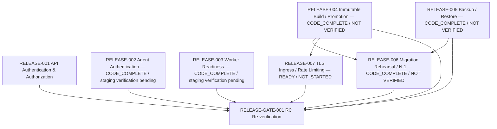

# Release Dependency Graph

This graph is separate from the product task dependency graph. It contains
only release items and the edges approved for the initial release backlog.

## Direct dependency table

| Release item     | Depends on                                                                                | Reason                                                                                                       |
| ---------------- | ----------------------------------------------------------------------------------------- | ------------------------------------------------------------------------------------------------------------ |
| RELEASE-001      | None                                                                                      | Foundational API security adapter is `CODE_COMPLETE`; real IdP/staging verification remains.                 |
| RELEASE-002      | None                                                                                      | Agent-channel authentication can be designed/configured independently while retaining fail-closed execution. |
| RELEASE-003      | None                                                                                      | No release-item dependency; RELEASE-003-R1 fixes the readiness profiles and all 13 worker policies.          |
| RELEASE-004      | None                                                                                      | R1 fixes the OCI/Compose host target, artifact, migration, promotion, and recovery contracts.                |
| RELEASE-005      | None                                                                                      | Establishes and proves backup/restore before migrations or promotion.                                        |
| RELEASE-006      | RELEASE-004, RELEASE-005                                                                  | Rehearsal must use the immutable release artifact and proven recovery path.                                  |
| RELEASE-007      | RELEASE-004                                                                               | Edge security validation must match the deployable release topology.                                         |
| RELEASE-GATE-001 | RELEASE-001, RELEASE-002, RELEASE-003, RELEASE-004, RELEASE-005, RELEASE-006, RELEASE-007 | Re-run the complete RC gate after all P0 evidence is verified.                                               |

## Derived readiness

Derived state after RELEASE-004 implementation:

- **CODE_COMPLETE, awaiting environment verification:** RELEASE-001.
- **CODE_COMPLETE, awaiting environment verification:** RELEASE-002.
- **CODE_COMPLETE, awaiting staging verification:** RELEASE-003.
- **CODE_COMPLETE / NOT VERIFIED:** RELEASE-004.
- **CODE_COMPLETE / NOT VERIFIED:** RELEASE-005.
- **CODE_COMPLETE / NOT VERIFIED:** RELEASE-006. Its isolated Podman
  rehearsal tooling, timeout controls and matrix evidence path are implemented;
  qualifying N-1 and production-like rehearsal evidence remain pending.
- **READY:** RELEASE-007. R1 fixes certificate lifecycle, trusted one-hop
  forwarding, rate/body/timeout limits, direct Agent mTLS and failure policy;
  implementation has not started.
- **BLOCKED:** None for the individual not-started items; verification
  blockers remain release-gate evidence.
- **WAITING_DEPENDENCY:** RELEASE-GATE-001, which waits for all verification
  evidence.

“Ready” means eligible to start under the release-item status model. It does
not claim verification. RELEASE-004 is `CODE_COMPLETE / NOT VERIFIED` under
[RELEASE-004-R1](items/RELEASE-004-R1_IMMUTABLE_ARTIFACT_DEPLOYMENT_PROMOTION_CONTRACT.md).
Its staging deployment remains pending. RELEASE-001 through RELEASE-003 remain
unverified pending their environment evidence. RELEASE-005 is independent and
its implementation is code-complete; protected backup, restore and RPO/RTO
evidence remain unverified.
RELEASE-007 is ready after
[RELEASE-007-R1](items/RELEASE-007-R1_PRODUCTION_EDGE_TLS_RATE_LIMITING_CONTRACT.md)
completion, but remains unstarted in this activity. Any newly discovered
blocker must be recorded on the affected item and readiness recomputed;
dependencies must not be bypassed.
