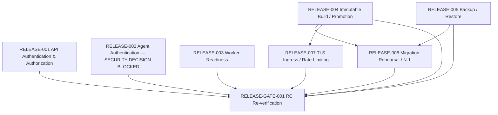

# Release Dependency Graph

This graph is separate from the product task dependency graph. It contains
only release items and the edges approved for the initial release backlog.

## Direct dependency table

| Release item     | Depends on                                                                                | Reason                                                                                                               |
| ---------------- | ----------------------------------------------------------------------------------------- | -------------------------------------------------------------------------------------------------------------------- |
| RELEASE-001      | None                                                                                      | Foundational API security adapter. R1/R2 resolved its contract gaps; runtime implementation and verification remain. |
| RELEASE-002      | None                                                                                      | Agent-channel authentication can be designed/configured independently while retaining fail-closed execution.         |
| RELEASE-003      | None                                                                                      | Worker health/readiness behavior is independent of release packaging.                                                |
| RELEASE-004      | None                                                                                      | Establishes immutable artifact and deployment lifecycle.                                                             |
| RELEASE-005      | None                                                                                      | Establishes and proves backup/restore before migrations or promotion.                                                |
| RELEASE-006      | RELEASE-004, RELEASE-005                                                                  | Rehearsal must use the immutable release artifact and proven recovery path.                                          |
| RELEASE-007      | RELEASE-004                                                                               | Edge security validation must match the deployable release topology.                                                 |
| RELEASE-GATE-001 | RELEASE-001, RELEASE-002, RELEASE-003, RELEASE-004, RELEASE-005, RELEASE-006, RELEASE-007 | Re-run the complete RC gate after all P0 evidence is verified.                                                       |

## Derived readiness

Derived readiness after RELEASE-002 contract review:

- **CODE_COMPLETE, awaiting environment verification:** RELEASE-001.
- **READY:** RELEASE-003, RELEASE-004, RELEASE-005.
- **BLOCKED:** RELEASE-002 (`SECURITY_DECISION / SPEC_GAP`).
- **WAITING_DEPENDENCY:** RELEASE-006, RELEASE-007, RELEASE-GATE-001.

“Ready” means eligible to start under the release-item status model. It does
not claim implementation or verification. Any newly discovered blocker must
be recorded on the affected item and readiness recomputed; dependencies must
not be bypassed.
