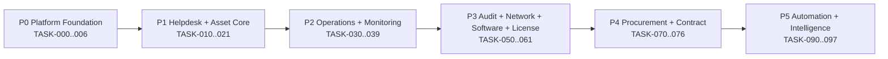
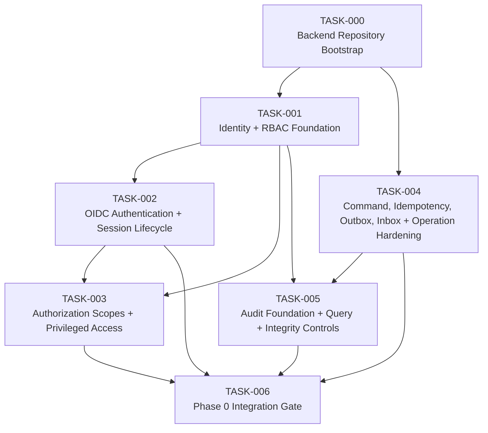
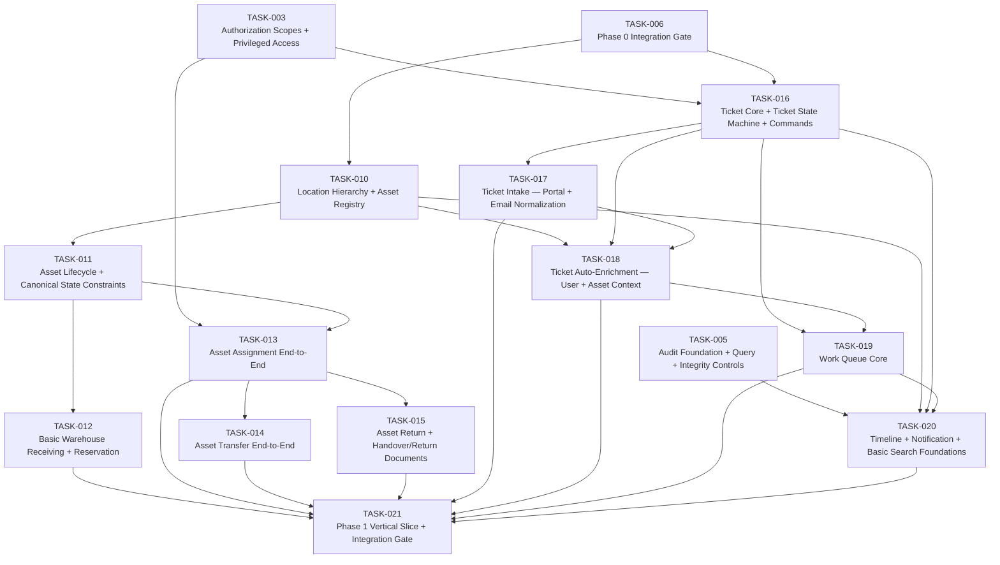
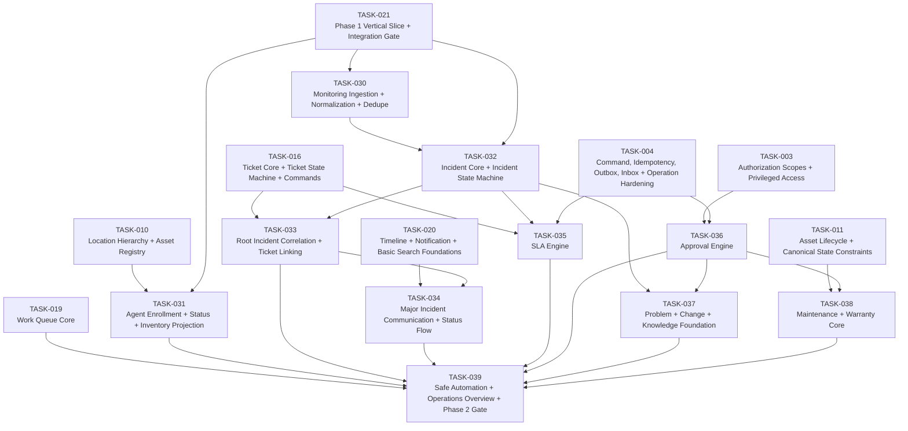
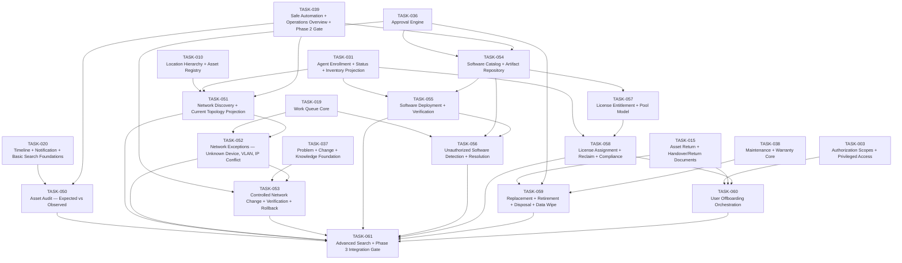
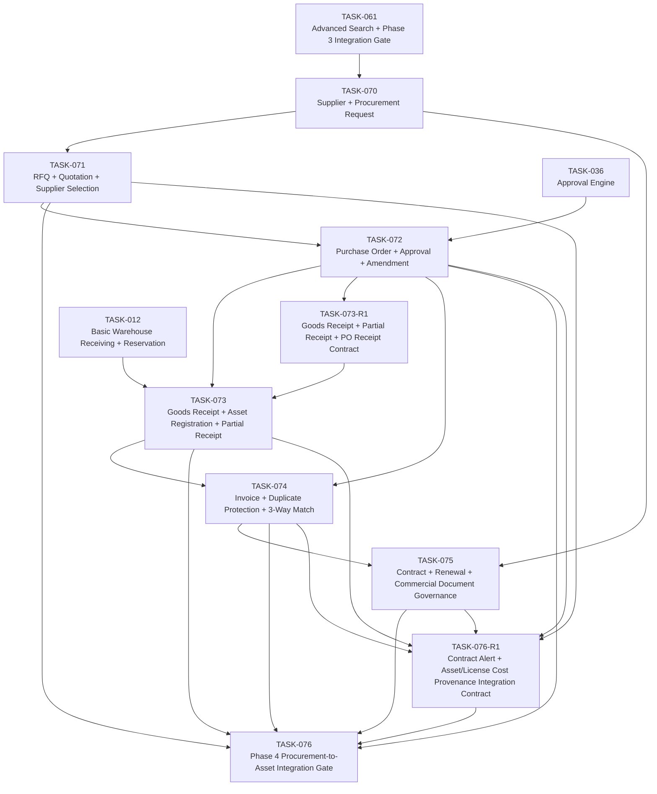
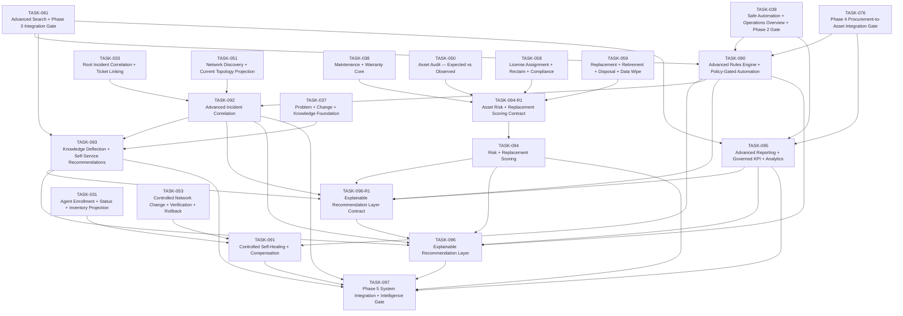

# CODEX TASK DEPENDENCY GRAPH
## IT Operations Hub — Phase 0 to Phase 5

**Version:** 0.1  
**Source:** `CODEX_TASK_REGISTRY.md`

This file is a visual companion to the registry. The registry remains authoritative for status/readiness.

---

# 1. Macro Phase Graph



---

# P0 — Platform Foundation



---

# P1 — Helpdesk + Asset Core MVP



---

# P2 — Operations + Monitoring + Maintenance



---

# P3 — Audit + Network + Software + License



---

# P4 — Procurement + Contract + Financial Control



---

# P5 — Automation + Intelligence + Advanced Reporting



---

# 8. Default Critical Path Summary

```text
TASK-000
→ TASK-001
→ TASK-002
→ TASK-003
→ TASK-005
→ TASK-006
→ TASK-010
→ TASK-011
→ TASK-013
→ TASK-016
→ TASK-018
→ TASK-019
→ TASK-020
→ TASK-021
→ TASK-030 / TASK-031
→ TASK-032
→ TASK-033
→ TASK-039
→ TASK-050 / TASK-051 / TASK-054
→ TASK-061
→ TASK-070
→ TASK-072
→ TASK-073-R1
→ TASK-073
→ TASK-074
→ TASK-076
→ TASK-090
→ TASK-097
```

This is the default backbone, not a prohibition on safe parallel work once dependencies are satisfied.

P5 automation boundary: TASK-090 evaluates event-triggered rules and creates
durable policy-gated Action Intents. TASK-091 consumes only eligible intents
and owns action execution, self-healing, retry, verification and
compensation. TASK-090 never invokes a remediation adapter.
